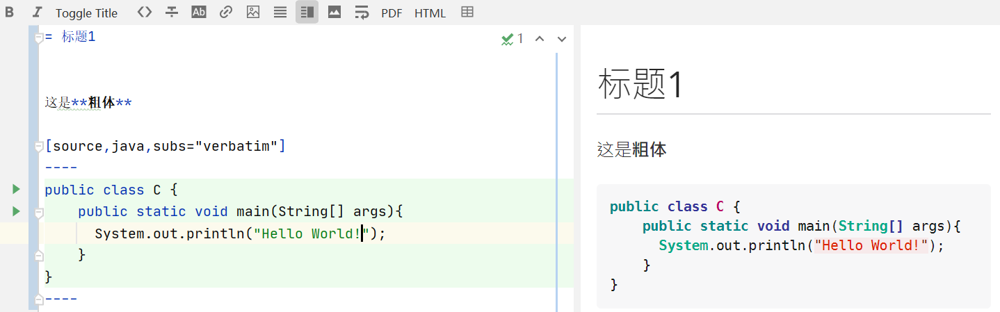
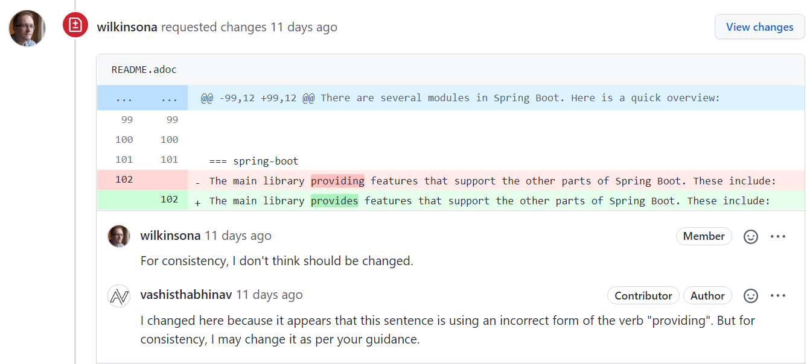

= 技术文档编写指南
pxzxj; pudge.zxj@gmail.com; 2021/12/12
:toc:


== Introduction
软件开发中文档跟代码同等重要，优秀的文档对软件的日常使用和后期维护都至关重要，另一方面结合国内软件厂商员工流动频繁的情况，完善文的档还能帮助新员工迅速熟悉项目及业务，
将人员变动的影响降到最低，保证项目持续稳定运作，当然最终也能在一定程度上节约企业成本。

既然文档如此重要，那么项目组必须保证在整个项目周期中输出各类文档，包括但不限于架构设计文档、详细设计文档、代码评审记录等。
然而大部分项目组的现状是文档缺失、管理混乱、随便写一下草草了事，其中原因当然跟需求变化快、开发周期紧、人员不足有关，
但是文档编写工具也会极大地影响编写效率和管理方式。
目前开发相关文档基本都是使用 `Word` 进行编写的，使用 `Word` 会存在下面几点问题：

1. 版本管理困难

    `Word` 文档是复杂格式的文档，使用版本管理软件无法方便地查看或对比每一次的修改内容。

2. 协作编写困难

    同样是因为 `Word` 文档的复杂格式，无法多人协作在一个文档上编辑，只能手动合并，
    合并后的文档以及无法区分特定内容的真正作者。

3. 代码支持性差

    `Word` 文档主要还是用于文本内容，代码的展示效果很差，除非手工再进行复杂的格式调整。

4. 格式调整耗时

    想要获得期望的整洁美观效果，通常需要不断调整文档格式，`Word` 的格式调整等都需要鼠标操作，
    键鼠切换通用会降低文档编写效率，这也正是Intellij IDEA提供了如此多快捷键的原因。

5. 需要单独上传

    通常是再桌面新建一个文档，如果要上传到SVN或者Git上还需要手动复制到对应目录，
    很多开发文档已经写了但忘记上传。

6. 需要单独下载

    文档编写完成之后必然要供其它人查看，而要查看 `Word` 编写的文档需要专门从SVN或Git上拣出。


== Docs as Code
针对上文描述的 `Word` 文档存在的诸多问题，国外的诸多企业开始基于 `Docs as Code` 的理念进行文档编写。`Docs as Code` 是指按照写代码的方式写文档，主要包括下面几点内容

- *使用简单文本编写文档*

    这一点是最重要的要求，只有简单文本才能使用Git强大的版本管理功能。

- *使用版本控制工具管理文档*

    文档总是在不断变化的，使用SVN、Git等版本控制工具能够查看文档所有的历史记录以及作者等信息。
    同代码一样，文档也可以使用分支管理等功能为软件的不同版本提供不同的文档。

- *文档评审*

    代码需要评审，文档也是一样，只有评审通过的文档才能合并到主干。
    评审可以是线下会议的方式进行也可以是线上Review Commit或者Pull Request的方式进行。

- *为文档编写测试*

    使用测试验证文档中错别字、失效链接、代码片段等，这一点一般不做强制要求。

- *文档自动化发布*

    文档提交后能够自动发布到特定文档站点上供其它人查看。

TIP: 更多关于 `Docs as Code` 的介绍参考 https://www.writethedocs.org/guide/docs-as-code/[writethedocs站点]

== AsciiDoc

https://asciidoctor.org/docs/what-is-asciidoc/[AsciiDoc] 是一种轻量级文本标记语言，可以用于创作笔记、文档、博客、电子书、网页、幻灯片、man手册，
它以简单文本的方式编写可以转换为html、pdf等多种格式，部分网站如GitHub支持直接将AsciiDoc内容呈现为html。

=== QuickStart

----
= The First Asciidoc example: Subtitle              <1>
Lars Vogel(c) 2016 vogella GmbH                     <2>
Version 0.3, 17.05.2021                             <3>
:sectnums:                                          <4>
:toc:                                               <5>
:toclevels: 4                                       <6>
:toc-title: My Content                              <7>
:experimental:                                      <8>
:description: Example AsciiDoc document             <9>
:imagesdir: ./img                                   <10>

This is the optional preamble (an untitled section body). Useful for
writing simple sectionless documents consisting only of a preamble.

== First section

Some text

== Second section

More test
----
1. 文档标题及副标题
2. 标题下一行列出作者信息
3. 文件修订版本
4. 需要展示各章节编号
5. 生出文档目录，toc即Table Of Contents
6. 默认toc仅展示两级目录，toclevel可以修改为其它值
7. 默认目录标题为 `Table Of Contents`，使用toc-title修改为其它值
8. 启用实验性功能
9. 文档的描述
10. 默认图片目录

=== Syntax

AsciiDoc相关语法参考 xref:asciidoc-syntax.adoc[AsciiDoc语法介绍]或者 https://docs.asciidoctor.org/asciidoc/latest/[官方站点]

=== AsciiDoc vs Markdown

TIP: https://docs.asciidoctor.org/asciidoc/latest/asciidoc-vs-markdown/[官方站点]详细对比了AsciiDoc和Markdown，本节内容主要是对其进行摘取和翻译

Markdown是最流行的轻量级文本标记语言，它的语法简单易于学习，很多开源项目的文档也都是使用Markdown编写的包括Dubbo、Nacos等，
然而语法简单也注定它无法满足一些复杂常见的文档编写需求包括表格、文档交叉引用、脚注、嵌入视频等。而AsciiDoc既保留了简洁的编写语法，
又考虑到了几乎所有场景的文档编写需求，很多技术书籍就是使用AsciiDoc编写完成后打印出版的。最重要的是AsciiDoc的语法设计为可扩展的，
用户完全可以根据自己的需求设计特殊AsciiDoc语法。

下表对AsciiDoc语法和Markdown语法的比较，不过此处仅关注了AsciiDoc和Markdown都支持的语法

[%asciidoc-vs-markdown%autowidth]
|===
|Language Feature |Markdown |AsciiDoc

|加粗(受约束)
a|
[source,markdown]
----
**bold**
----
a|
[source]
----
*bold*
----

|加粗 (不受约束)
a|
[source,markdown]
----
**b**old
----
a|
[source]
----
**b**old
----

|斜体 (受约束)
a|
[source,markdown]
----
*italic*
----
a|
[source]
----
_italic_
----

|斜体 (不受约束)
|_n/a_
a|
[source]
----
__i__talic
----

|等宽词 (受约束)
a|
[source,markdown]
----
`monospace`
----
a|
[source]
----
`monospace`
----

|等宽词 (不受约束)
a|
[source,markdown]
----
`m`onospace
----
a|
[source]
----
``m``onospace
----

|超链接
a|
[source,markdown]
----
[Asciidoctor](https://asciidoctor.org)
----
a|
[source]
----
https://asciidoctor.org[Asciidoctor]
----

|相对路径链接
a|
[source,markdown]
----
[user guide](user-guide.html)
----
a|
[source]
----
link:user-guide.html[user guide]
xref:user-guide.adoc[user guide]
----

|文件链接
a|
[source,markdown]
----
[get the PDF]({{ site.url }}/assets/mydoc.pdf)
----
a|
[source]
----
link:{site-url}/assets/mydoc.pdf[get the PDF]
----

|交叉引用
a|
[source,markdown]
----
See [Usage](#_usage).

<h2 id="_usage">Usage</h2>
----
a|
[source]
----
See <<_usage>>.

== Usage
----

|锚点
a|
[source,markdown]
----
<h2 id="usage">Usage</h2>
----
a|
[source]
----
[#usage]
== Usage
----

|内联图片
a|
[source,markdown]
----

----
a|
[source]
----
image:logo.png[Logo]
----

|图片
|_n/a_
a|
[source]
----
image::logo.png[Logo]
----

|章节标题
a|
[source,markdown]
----
## Heading 2
----
a|
[source]
----
== Heading 2
----

|引用
a|
[source,markdown]
----
> Quoted text.
>
> Another paragraph in quote.
----
a|
[source]
----
____
Quoted text.

Another paragraph in quote.
____
----

|文本
a|
[source,markdown]
----
    $ gem install asciidoctor
----
a|
.Indented (by 1 or more spaces)
[source]
----
 $ gem install asciidoctor
----

.Delimited
[source]
----
....
$ gem install asciidoctor
....
----

|代码
a|
[source,markdown]
----
```java
public class Person {
  private String name;
  public Person(String name) {
    this.name = name;
  }
}
```
----
a|
[source]
....
[source,java]
----
public class Person {
  private String name;
  public Person(String name) {
    this.name = name;
  }
}
----
....

|无序列表
a|
[source,markdown]
----
* apples
* orange
  * temple
  * navel
* bananas
----
a|
[source]
----
* apples
* oranges
** temple
** navel
* bananas
----
|有序列表
a|
[source,markdown]
----
1. first
2. second
3. third
----
a|
[source]
----
. first
. second
. third
----

|文档头
a|
.Slapped on as "`front matter`"
[source,markdown]
----
---
layout: docs
title: Writing posts
prev_section: defining-frontmatter
next_section: creating-pages
permalink: /docs/writing-posts/
---
----
a|
.Native support!
[source]
----
= Writing posts
:page-layout: base
:showtitle:
:prev_section: defining-frontmatter
:next_section: creating-pages
----

|警告
|_n/a_
a|
[source]
----
TIP: You can add line numbers to source listings by adding the word `numbered` in the attribute list after the language name.
----

|块标题
|_n/a_
a|
[source]
----
.Grocery list
* Milk
* Eggs
* Bread
----
|===

NOTE: 受约束的是指使用时前后必须有空格，不受约束的则表示可以在任何地方使用

== Asciidoctor

https://asciidoctor.org/[Asciidoctor] 是最流行的AsciiDoc处理软件，它使用Ruby编写，源码托管在GitHub上，
很多知名的项目如Spring、Hibernate、JUnit等都是使用Asciidoctor生成项目文档的。

AsciiDoctor能够快速将asciidoc文档转换为Html5、Docbook、Pdf、Epub3等多种格式。
同时AsciiDoctor还提供了很多扩展接口，允许开发者根据特定需求扩展AsciiDoctor的功能，
下文介绍的 `Bilibili Extension` 以及 `Spring Backend` 就是对AsciiDoctor的扩展。

Asciidoctor包含了多种不同形式的实现用于满足不同人员的需求，包括命令行工具、Intellij IDEA插件、浏览器插件、Maven插件、Gradle插件等，
本文选择对Java开发者比较友好的Intellij IDEA和maven插件进行介绍。

=== Intellij IDEA Plugin
搜索AsciiDoc插件安装即可。

image::images/install-from-marketplace.png[]

插件安装完成后新建.adoc结尾的文件就会自动使用此插件，左侧为使用asciidoc编写的原始内容，右侧为渲染后的效果。



=== Asciidoctor-Maven-Plugin

Asciidoctor Maven Plugin可以将AsciiDoc文档转换为多种格式。跟其它Maven插件一样，在 `pom.xml` 中添加AsciiDoctor插件配置即可开始使用。

[source,xml,subs="verbatim"]
----
<project>
    ...
    <build>
        ...
        <plugin>
            <groupId>org.asciidoctor</groupId>
            <artifactId>asciidoctor-maven-plugin</artifactId>
            <version>2.2.1</version>
            <executions>
                <execution>
                    <id>convert-to-html</id>
                    <phase>generate-resources</phase>          <1>
                    <goals>
                        <goal>process-asciidoc</goal>
                    </goals>
                    <configuration>
                        <outputDirectory>${project.build.directory}/html</outputDirectory>       <2>
                        <attributes>                           <3>
                            <source-highlighter>coderay</source-highlighter>
                            <imagesdir>./images</imagesdir>
                            <toc>left</toc>
                            <icons>font</icons>
                        </attributes>
                    </configuration>
                </execution>
            </executions>
        </plugin>
  ...
</project>
----
1. 配置插件执行阶段和目标
2. `Configuration` 中配置插件相关参数
3. 文档属性

`Configuration` 中支持众多参数的配置，下面选择几个重要的进行说明，完整参数列表参考 https://docs.asciidoctor.org/maven-tools/latest/plugin/goals/process-asciidoc/[官方文档]

_**sourceDirectory**_ ::
    源文件目录，默认检查 __/src/docs/asciidoc, /src/asciidoc和/src/main/asciidoc__。
_**sourceDocumentName**_ ::
    源文件名称，默认检查 `sourceDirectory` 下的所有文件。
_**sourceDocumentExtensions**_ ::
    源文件扩展名，默认包含__ad, adoc, and asciidoc__。
_**outputDirectory**_ ::
    转换后文件输出目录，默认为__${project.build.directory}/generated-docs.__。
_**backend**_ ::
    转换目标类型，默认是html5。
_**doctype**_ ::
    支持book和article，默认使用article。

=== Spring Backend
Asciidoctor提供了通用的文档输出格式，而不同框架或软件则可以根据自身需求进行扩展，Spring为了提升文档可读性创建了 https://github.com/spring-io/spring-asciidoctor-backends[spring-asciidoctor-backends]项目用于生成Spring风格的html文档。

==== Install
再Asciidoctor Maven插件中添加Spring Backend相关配置即可使用。
[source,xml,subs="verbatim"]
----
<plugin>
	<groupId>org.asciidoctor</groupId>
	<artifactId>asciidoctor-maven-plugin</artifactId>
	<version>2.1.0</version>
	<executions>
		<execution>
			<id>generate-html-documentation</id>
			<phase>prepare-package</phase>
			<goals>
				<goal>process-asciidoc</goal>
			</goals>
			<configuration>
				<backend>spring-html</backend>                      <1>
			</configuration>
		</execution>
	</executions>
	<dependencies>
		<dependency>                                                <2>
			<groupId>io.spring.asciidoctor.backends</groupId>
			<artifactId>spring-asciidoctor-backends</artifactId>
			<version>${spring-asciidoctor-backends.version}</version>
		</dependency>
	</dependencies>
</plugin>

<repositories>
	<repository>                                                    <3>
		<id>spring-release</id>
		<name>Spring Releases</name>
		<url>https://repo.spring.io/release</url>
		<snapshots>
			<enabled>false</enabled>
		</snapshots>
	</repository>
</repositories>
----
1. backend设置为spring-html
2. 添加spring-backend依赖
3. 配置Spring Maven仓库

==== Spring Look and Feel
生成的html样式与Spring官网保持一致，左上角展示Spring的Logo。

TIP: 后期可能会允许使用自定义的Logo，参考 https://github.com/spring-io/spring-asciidoctor-backends/issues/24[Ability to override the banner logo]

==== Responsive Design
生成的html遵循响应式设计，能在各种设备上很好地展示，如台式机、平板电脑、智能手机等。

==== "Back to Index" Link
如果当前页面部署index.html,那么提供一个Back to Index链接用于返回到首页

==== Dark Mode
页面右上角支持切换黑夜模式，模式设置保存在本地，无需每次重新加载后设置

==== Tabs
支持多个Tab页合并与切换，常见的如Maven和Gradle，Java和Groovy、Kotlin

[source,xml,indent=0,role="primary"]
.Maven
----
<dependency>
    <groupId>com.example</groupId>
    <artifactId>some-library</artifactId>
    <version>1.2.3</version>
</dependency>
----

[source,indent=0,role="secondary"]
.Gradle
----
compile 'com.example:some-library:1.2.3'
----

==== Code Folding
折叠部分非核心代码，例如Java代码的import或者getter、setter

[source,java]
----
public class Example {

	private String first;

	private String second;

	// @fold:on // getters / setters...
	public String getFirst() {
		return this.first;
	}

	public void setFirst(String first) {
		this.first = first;
	}

	public String getSecond() {
		return this.second;
	}

	public void setSecond(String second) {
		this.second = second;
	}
	// @fold:off

}
----

==== Different Config Blocks
configblocks用于生成同一配置的yaml格式和properties格式，例如下面的源文件和渲染后效果

-----
[source,yaml,configblocks]
----
example:
  property:
    alpha: a
----
-----

[source,yaml,configblocks]
----
example:
  property:
    alpha: a
----

NOTE: 此功能还需要添加 `io.spring.asciidoctor:spring-asciidoctor-extensions-spring-boot` 依赖，参考 https://github.com/spring-io/spring-asciidoctor-extensions[spring-asciidoctor-extensions]


=== Bilibili Extension
文档中插入视频是很常见的需求，可能是需要记录视频教程的学习笔记，也可能是使用视频对文档的内容做进一步说明。
默认Asciidoctor仅支持在文档中插入Youtube、vimeo视频或者本地视频文件，但国内开发者更多使用的是Bilibili，
因此开发了 `asciidoctor-bilibili-extension` 用于向AsciiDoc文档中插入Bilibili视频，
详细用法参考 https://github.com/pxzxj/asciidoctor-bilibili-extension[asciidoctor-bilibili-extension]。


== Examples

Asciidoctor提供了大量的 https://github.com/asciidoctor/asciidoctor-maven-examples[Maven示例]用于说明相关功能，本文选择常用的几类进行说明

=== Html
参考 https://github.com/asciidoctor/asciidoctor-maven-examples/tree/main/asciidoc-to-html-example[asciidoc-to-html-example]，也可以参考<<cicd, CI/CD示例>>。

=== Pdf
参考 https://github.com/asciidoctor/asciidoctor-maven-examples/tree/main/asciidoctor-pdf-cjk-example[asciidoctor-pdf-cjk-example]，也可以参考<<cicd, CI/CD示例>>。

[[cicd]]
=== CI/CD

`Docs as Code` 要求文档同代码一样能够在CI/CD流水线中自动发布，例如可以将生成的html文件部署到nginx搭建的站点上就可以直接在浏览器中查看文档了，
由于文档是使用Maven插件生成的，因此整个发布过程与普通Java项目没有任何区别。
本文使用 `GitHub Action` 以及 `GitHub Pages` 演示CI/CD过程，示例代码参考 https://github.com/pxzxj/asciidoc-cicd-demo[asciidoc-cicd-demo]。

=== Doc Review
代码需要评审，文档也一样，通过文档评审可以逐步提升文档质量以及团队文档编写能力。

GitHub和GitLab都提供了强大的 `Review` 功能，可以对PR的内容进行评审和讨论，只有评审通过的内容才会合并。
以Spring Boot项目中的一个对 `README.adoc` 润色的 https://github.com/spring-projects/spring-boot/pull/28835[PR]为例，
Spring成员查看提交的内容并提出疑问，原作者进行回复



== Style
上文主要讨论了编写技术文档使用的工具，而文档编写的另一个重要主题是写作规范，
使用陈述句还是祈使句、使用第一人称还是第二人称等等这些语法细节也会影响最终文档的质量。

Spring就非常重视文档写作规范， https://github.com/spring-io/spring-asciidoctor-backends/blob/main/guides/style-guide.adoc[spring-style]详细描述了编写Spring技术文档相关规范，
同时还根据开发者反馈对文档不断进行 https://github.com/spring-projects/spring-boot/issues/27895[优化]，可以说完善的文档也是Spring框架如此成功的重要原因之一。

中文技术领域目前比较受开发者认可的是由阮一峰编写的 https://www.ruanyifeng.com/blog/2016/10/document_style_guide.html[中文技术文档的写作规范]，GitHub的Star数量已经接近一万。

== Best Practice

1. 先列举文档的目录，再补充各章节的内容。
2. 参考优秀的开源项目文档。
3. 内容为王，时间紧急情况下优先保证内容，其次考虑格式美观。
4. **写**，立即开始。