= 英语语法入门
pxzxj; pudge.zxj@gmail.com; 2024/10/07

bilibili::BV1Mx41197CQ[]

老师在一开始提出她认为的英语教学的正确方式是先介绍整个语法体系的结构，
再逐一攻破具体的单项知识点，当然此方法不只适用与英语语法学习也适用于其他大部分知识的学习

== 句子

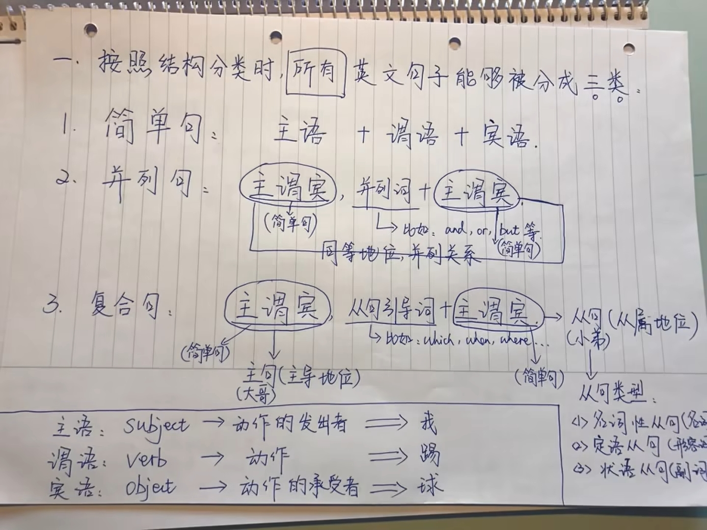

并列句中并列词后不一定是完整的主谓宾结构，可能与前面的句子共用主语

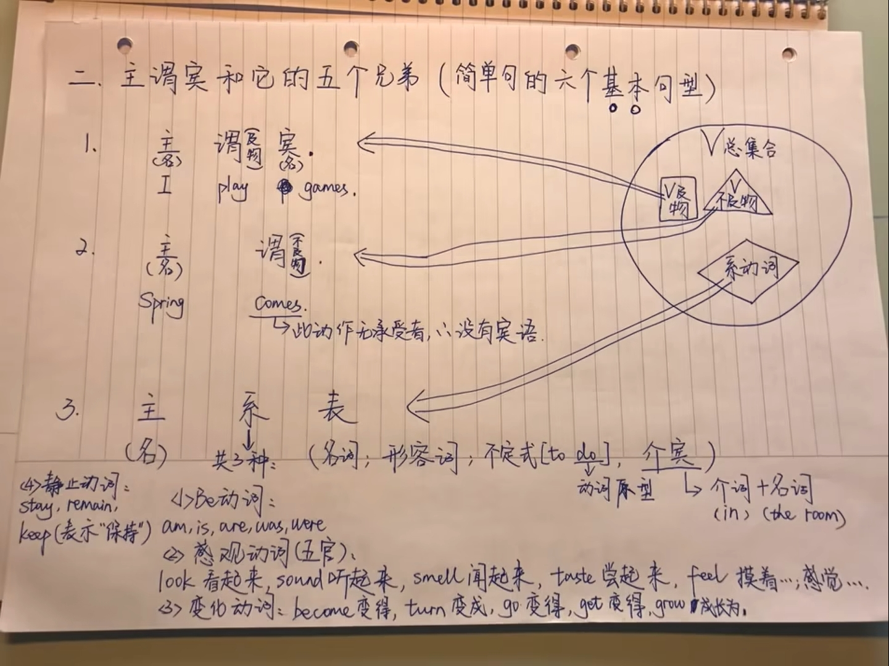

右侧及物动词和不及物动词的两个集合实际上是存在交集的因为有些动词既可以作为及物动词又可以作为不及物动词

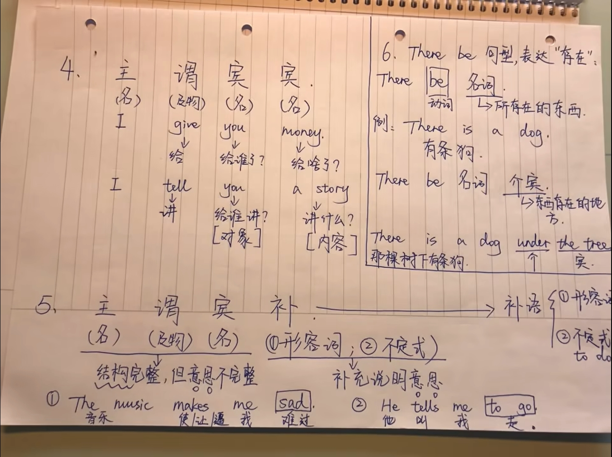

== 从句

=== 名词性从句

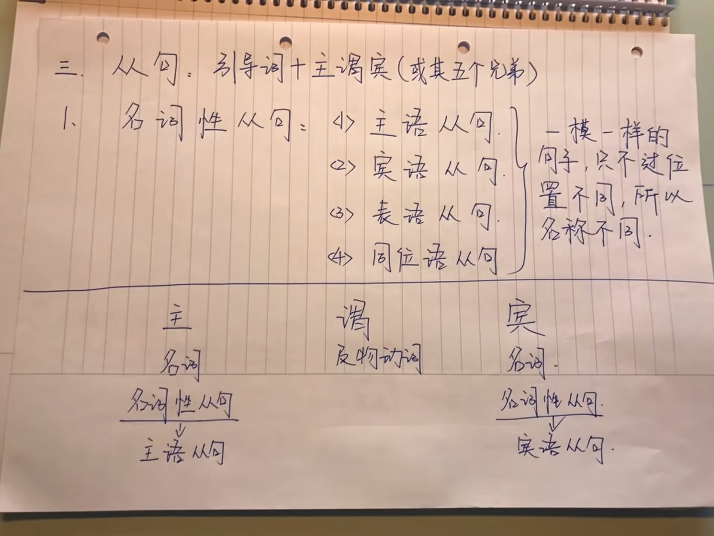

常见的名词性从句引导词有 `that`、`whether`、`what`

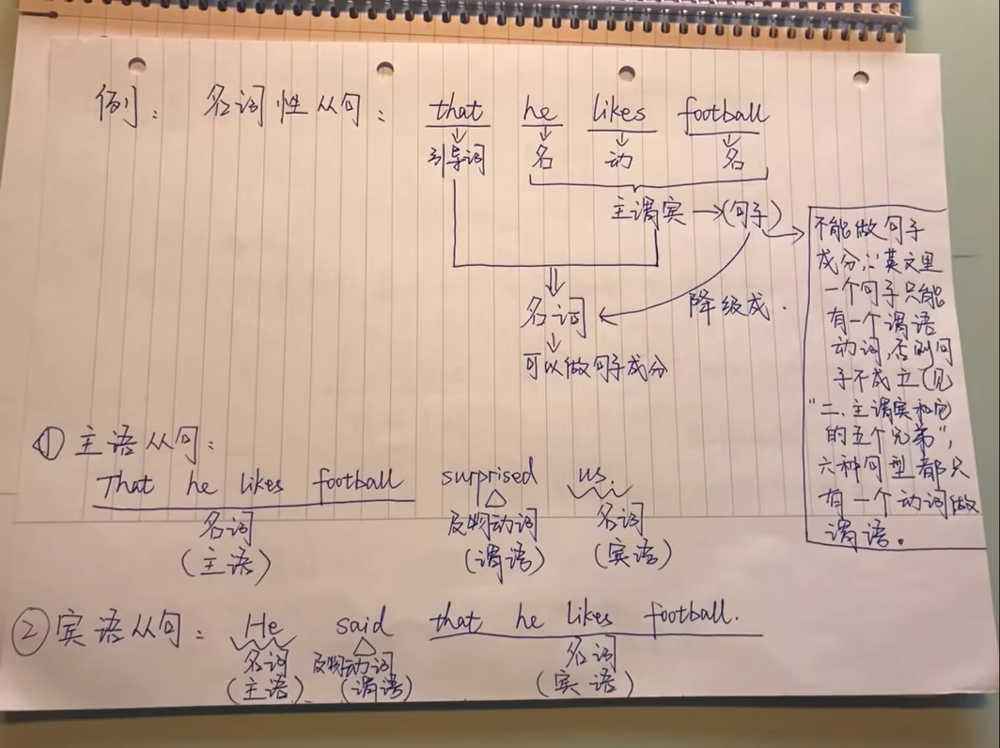

image::images/english-grammer-introduction/6.png[]

同位语从句的引导词只会是 `that`

=== 定语从句

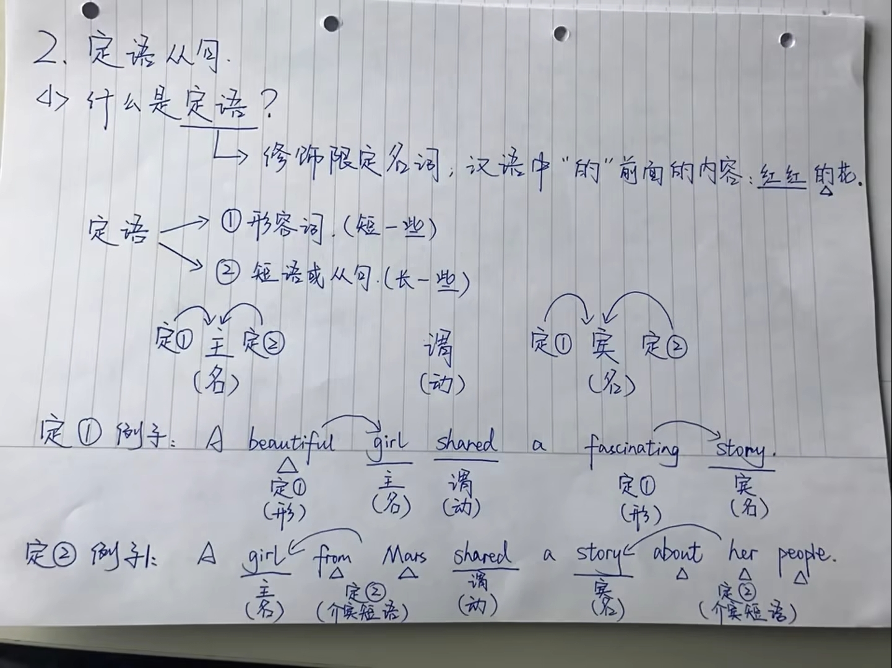

英文忌讳头重脚轻，而定语短语或从句比较长所以放后面

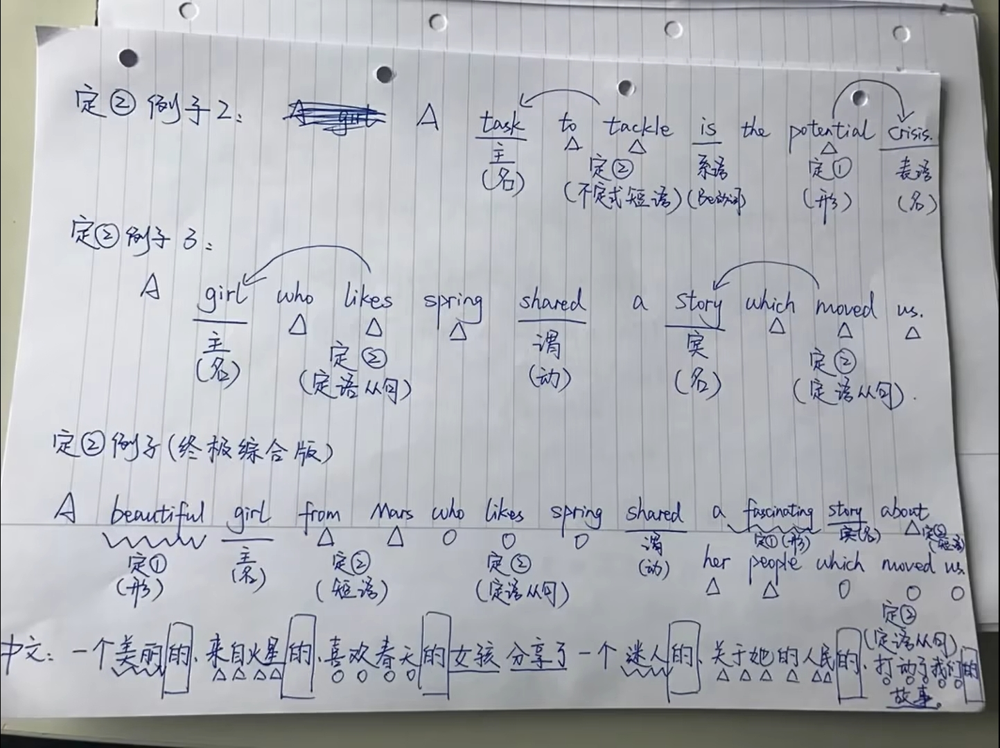

=== 状语从句

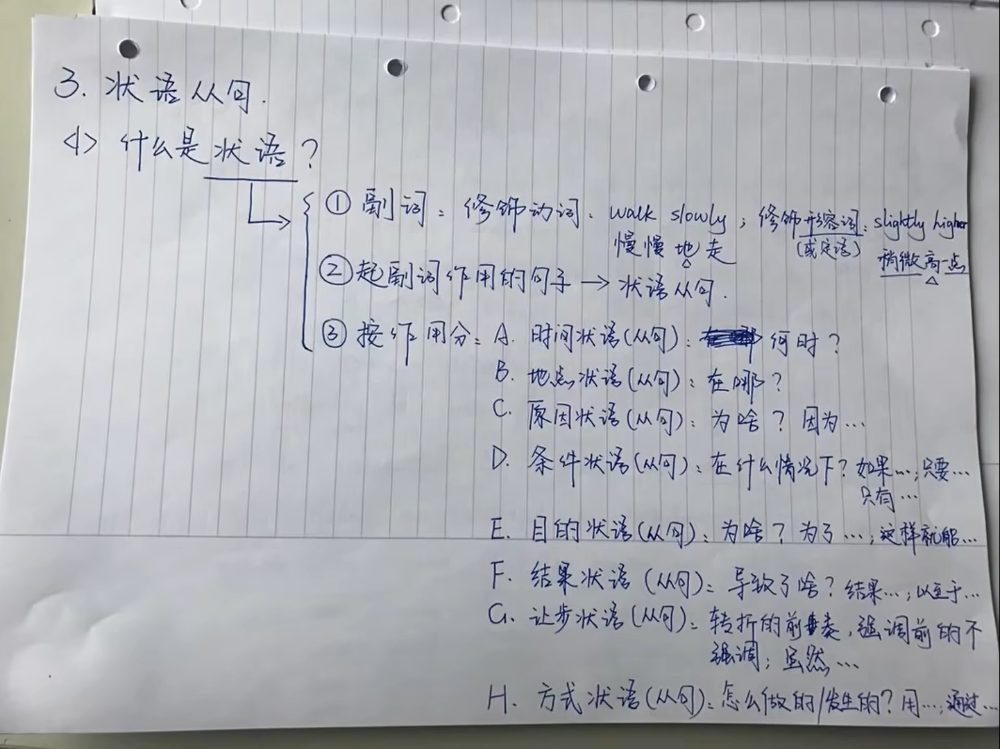

image::images/english-grammer-introduction/10.png[]

注意 `pretty` 是弱化，pretty tall不如tall高

`because` 除了用作原因状语从句的引导词外还可以在句首用于引导主语从句

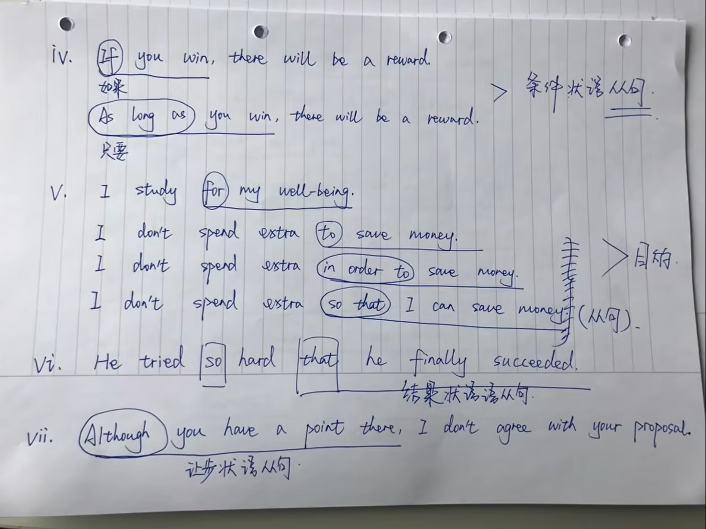

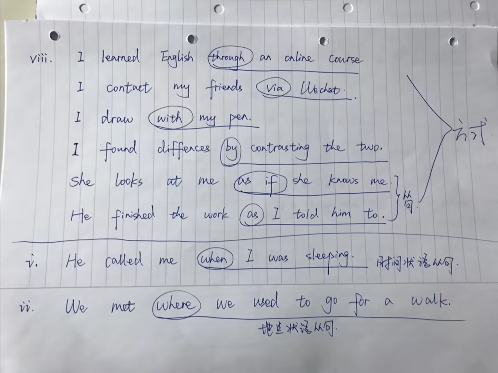

== 特殊句式

image::images/english-grammer-introduction/13.png[]

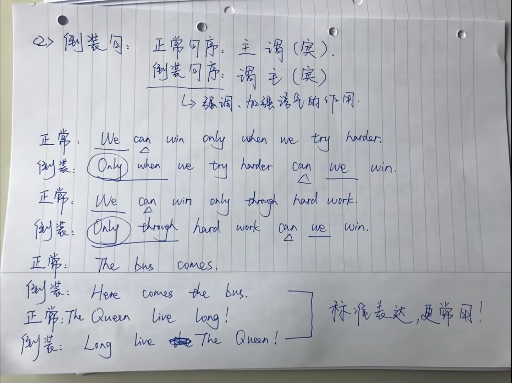

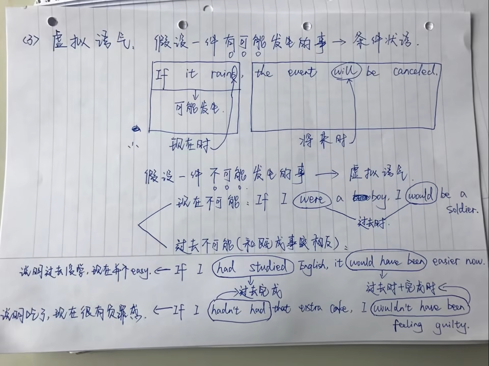

== 时态

image::images/english-grammer-introduction/16.png[]

过去时只是单纯表达过去发生的事实，而完成时表达了相对于另一个时间点的影响或者意义，例如 `He lost his job` 表达了他之前失业了至于现在的情况则不清楚，而 `He has lost his job` 就表达了他现在还是失业状态

image::images/english-grammer-introduction/17.png[]

== 语态

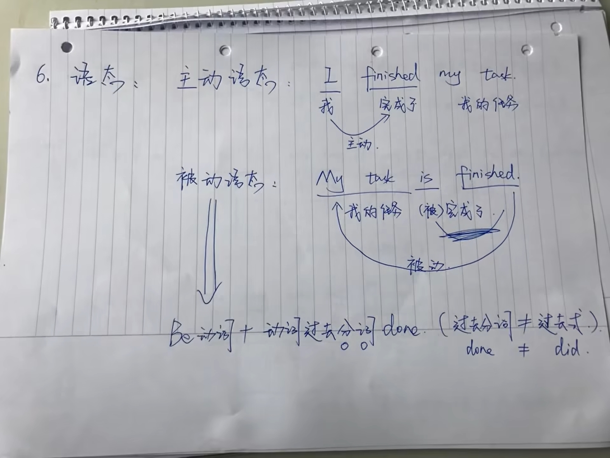

== 非谓语

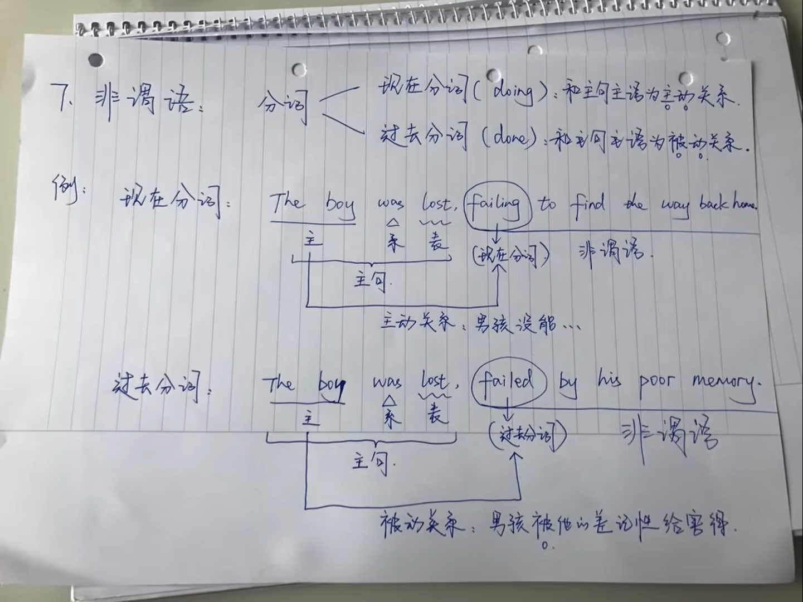