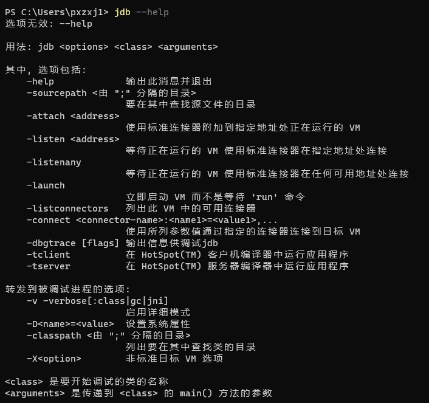
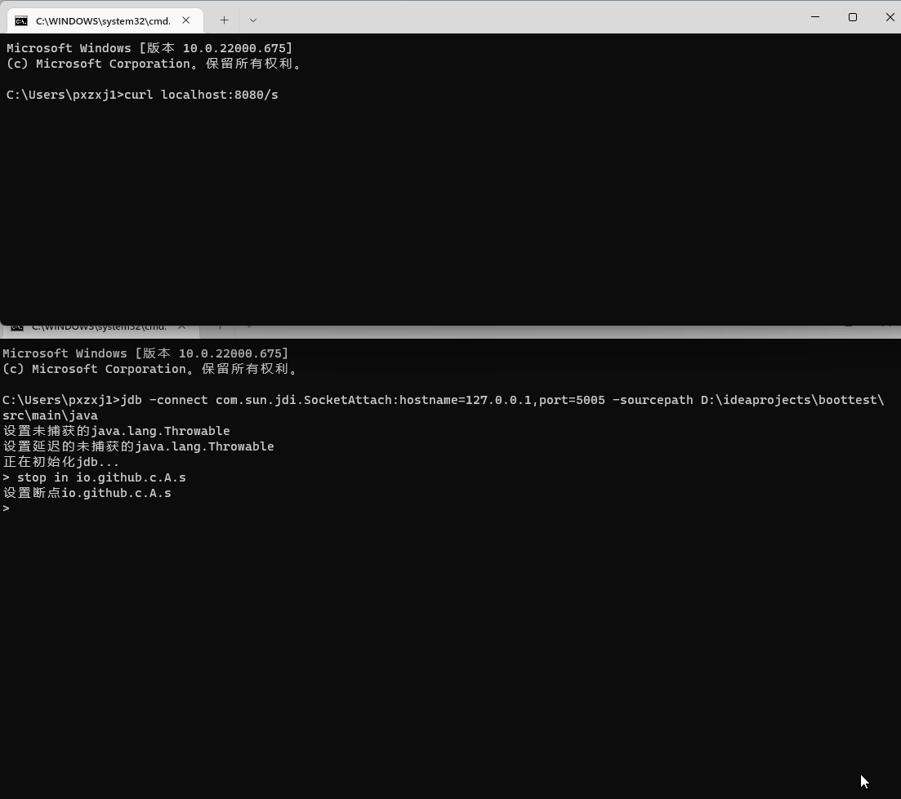
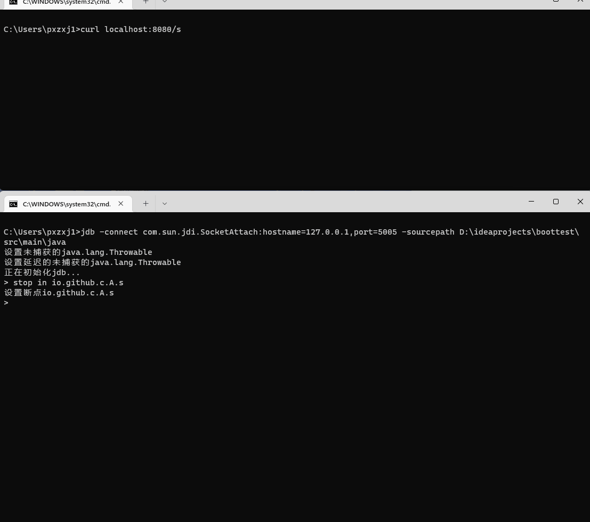
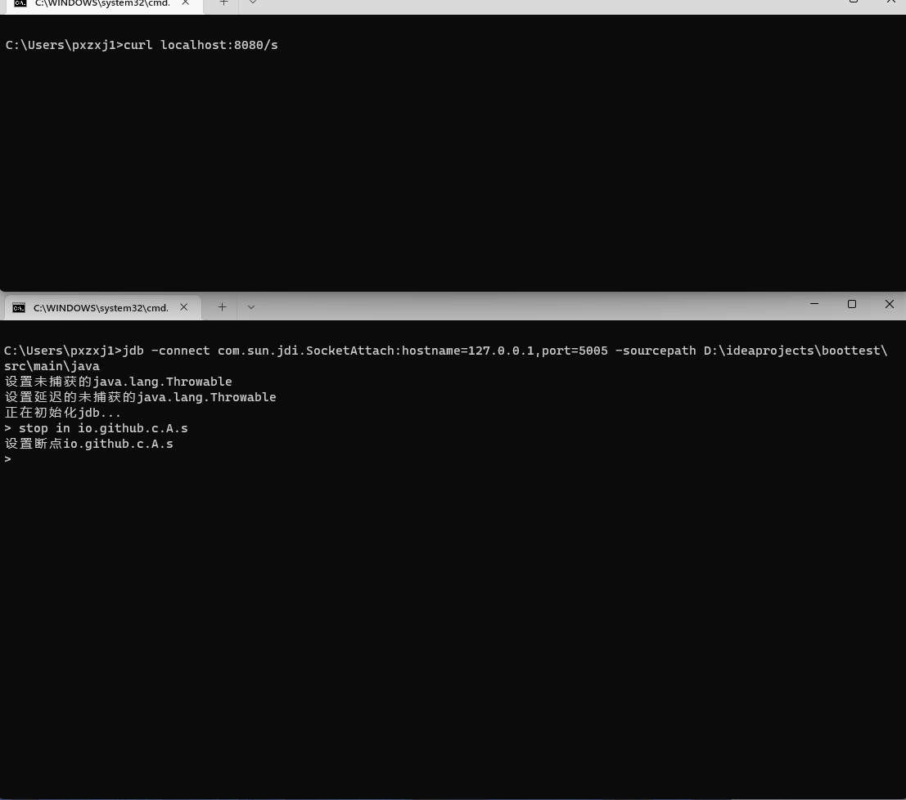
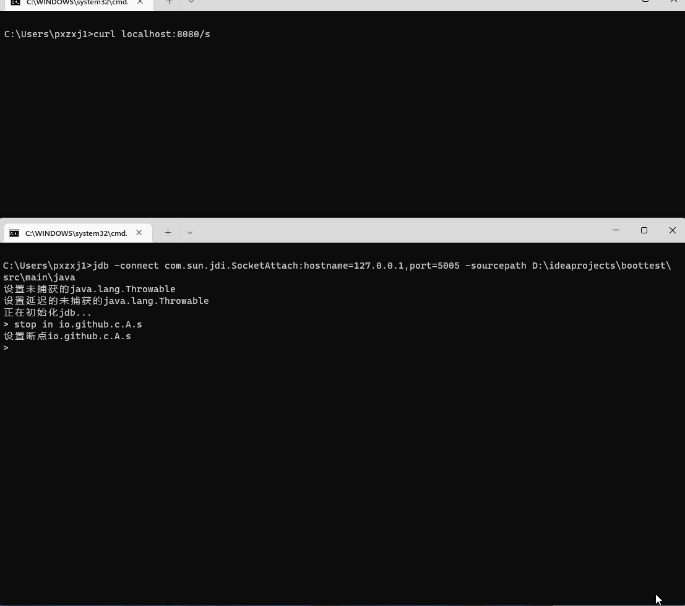
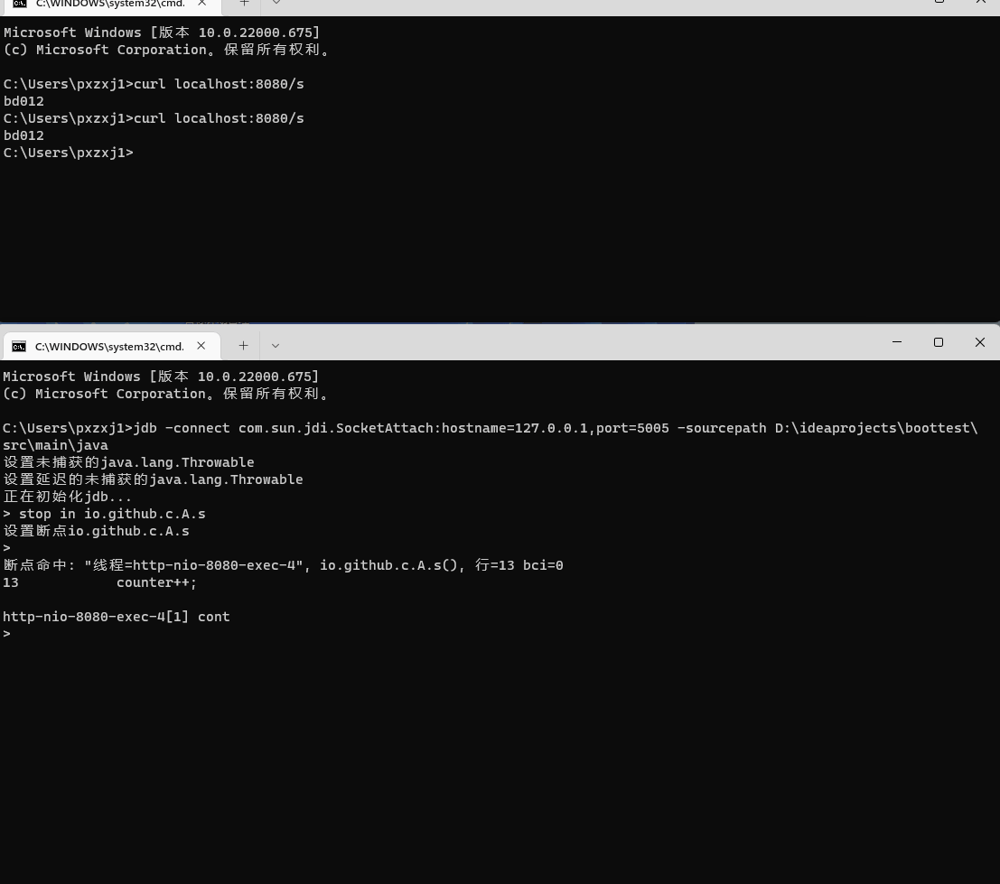

= JDB(Java Debugger)
pxzxj; pudge.zxj@gmail.com
:revnumber: v1.0
:revdate: 2022/05/23

调试器是软件开发领域最重要的工具之一，对Java开发来说，在开发环境可以使用Intellij IDEA进行debug从而快速解决问题，但在部署环境由于无法debug
经常需要耗时费力地添加打印语句并替换部署包。实际上JDK已经提供了一个命令行debug工具jdb，可以在任何环境使用它实现快速有效地问题定位。

== 简介

The Java Debugger (https://docs.oracle.com/javase/8/docs/technotes/tools/unix/jdb.html[JDB]) 是一个简单的命令行调试工具，
使用它可以像Intellij IDEA一样进行添加断点、单步执行、变量查看等操作，实际上jdb和Intellij IDEA底层都利用了
Java Platform Debugger Architecture (http://docs.oracle.com/javase/8/docs/technotes/guides/jpda/index.html[JDBA])
实现调试功能，只是展现方式不同而已。

== 用法

jdk的bin目录下包含了jdb，jdb命令的基础语法是 `*jdb* [options] [classname] [arguments]`，其中 `options` 是命令的选项，`classname` 和 `arguments` 是要调试的main类名和main方法参数。

可以注意到jdb命令的 `classname` 和 `arguments` 都使用了中括号，表示它们都不是必须的，因为jdb还可以attache到一个已经在运行的JVM上，方法与普通的 `Remote Debug` 相同，调试Spring Boot应用时使用这种方法更方便。

[source,bash,subs="verbatim"]
----
#启动时添加debug参数
java -agentlib:jdwp=transport=dt_socket,server=y,suspend=n,address=5005 -jar app.jar

#attach到已经启动的JVM上
jdb -attach 5005

#与attach效果相同，attach失败时可以使用此命令
jdb -connect com.sun.jdi.SocketAttach:hostname=127.0.0.1,port=5005
----

jdb执行成功后会进入到一个交互式shell页面中，后续的调试操作都在此shell中进行，具体调试方法参考<<example, 示例>>章节

image::images/jdb-connect.png[]

[[option]]
== 选项

使用help可以查看jdb的选项，不同版本JDK的选项有所不同，Windows下jdk8支持如下选项

进入调试shell后可以查看debug相关命令，<<example, 示例>>章节会演示主要的添加断点、单步执行等命令

image::images/jdb-options2.png[]

[[example]]
== 示例

本节演示如下比较常用的调试命令

|===
|命令 |描述

|`stop in <class id>.<method>[(argument_type,...)]`
|在方法中设置断点

|`stop at <class id>:<line>`
|在行中设置断点

|`clear`
|查看所有断点

|`clear <class id>.<method>[(argument_type,...)]`
|清除方法中的断点

|`clear <class id>:<line>`
|清除行中的断点

|`step`
|执行当前行

|`step up`
|一直执行, 直到当前方法返回到其调用方

|`stepi`
|执行当前指令

|`next`
|步进一行 (步过调用)

|`cont`
|从断点处继续执行

|`locals`
|输出当前堆栈帧中的所有本地变量

|`print <expr>`
|输出表达式的值

|`dump <expr>`
|输出所有对象信息

|`eval <expr>`
|对表达式求值 (与 print 相同)

|`list [line number\|method]`
|输出源代码

|`methods <class id>`
|列出类的方法

|`fields <class id>`
|列出类的字段

|`!!`
|重复执行最后一个命令

|`<n> <command>`
|将命令重复执行 n 次
|===

=== 创建项目

创建一个Spring Boot项目添加 `starter-web` 依赖，并添加如下Controller

[source,java,subs="verbatim"]
----
package io.github.c;

import org.springframework.web.bind.annotation.GetMapping;
import org.springframework.web.bind.annotation.RestController;

@RestController
public class A {

    private int counter = 0;

    @GetMapping("/s")
    public String s() {
        counter++;
        System.out.println("counter = " + counter);
        return a();
    }

    public String a() {
        String b = b();
        for(int i = 0; i < 3; i++) {
            b += i;
        }
        return b;
    }

    public String b() {
        String s = "b";
        s += "d";
        return s;
    }
}
----

=== 启动项目

项目打包后使用如下命令启动

[source,bash,subs="verbatim"]
----
java -agentlib:jdwp=transport=dt_socket,server=y,suspend=n,address=5005 -jar app.jar
----

在另一个shell中使用jdb命令attach到启动的JVM上，注意命令末尾使用 `-sourcepath` 参数指定了项目的源码位置，这样在调试时可以查看对应的源码

[source,bash,subs="verbatim"]
----
jdb -connect com.sun.jdi.SocketAttach:hostname=127.0.0.1,port=5005 -sourcepath D:\ideaprojects\boottest\src\main\java
----

=== 添加断点

使用 `stop in io.github.c.A.s` 添加断点，然后调用 `/s` 接口可以看到jdb会话中出现断点命中的提升并自动进入
对应线程，使用 `cont` 可以继续执行

=== 断点调试

断点调试的命令有 `step`、`step up`、`next`、`stepi` 这几条，下面演示其不同效果

==== step
step命令调试的效果如下所示，可以看到如果存在方法调用，step会自动进入调用的方法一步步执行，这也是它与下面的next命令的主要区别

==== next

next命令调试效果如下所示，可以看到即使存在方法调用它也不会进入调用的方法

image::images/breakpoint4.gif[]

==== step up
step up命令会执行完成当前方法并返回，效果如下所示

==== stepi
stepi命令不是按照源码中的语句执行的，而是按照编译后的字节码指令执行的，所以会看到
连续多次都在执行 `counter++`，但后面的 `bci` 不断增加，bci是字节码序号(byte code index)的缩写

==== 查看变量和源码

print命令和list命令使用效果如下

=== 清除断点

使用 `clear` 查看已经添加的断点，使用 `clear <class>:<line_number>` 或者 `clear <class>.<method_name>[(argument_type,...)]`
删除已经添加的断点

