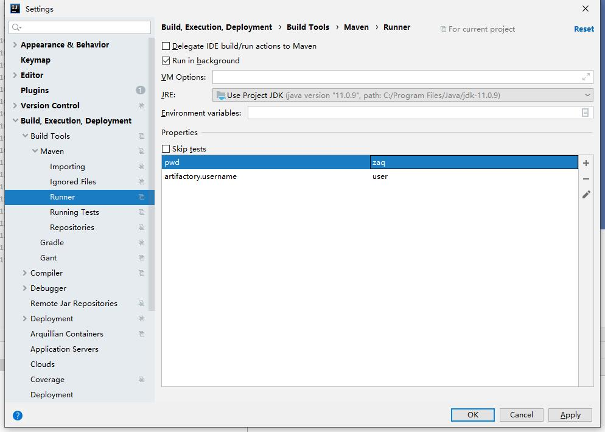

= Maven实战
pxzxj; pudge.zxj@gmail.com; 2022/06/09

本文根据国内Maven专家许晓斌在InfoQ连载的系列文章 https://www.infoq.cn/profile/DC5848403A32D1/publish/all[Maven实战]以及个人使用经验整理而成，主要介绍Maven的日常使用方法和技巧

== 坐标规划

坐标是 Maven 核心的核心，因此规划正确的坐标至关重要，如果你使用了模糊不清的坐标，那么你的用户就很难找到你的构件，或者即使找到了，也容易写错。错误的使用坐标，还会造成冲突，如果你使用 junit 这样的 groupId，那会发生什么？下面先看一些不是很规范的坐标使用方式。

=== 坐标规划的原则

滥用坐标、错用坐标的样例比比皆是，在中央仓库中我们能看到SpringFramework 有两种坐标，其一是直接使用springframework 作为groupId，如springframework:spring-beans:1.2.6，另一种是用org.springframework 作为groupId，如org.springframework:spring-beans:2.5。细心看看，前一种方式显得比较随意，后一种方式则是基于域名衍生出来的，显然后者更合理，因为用户能一眼根据域名联想到其Maven 坐标，方便寻找。因此新版本的SpringFramework 构件都使用org.springframework 作为groupId。由这个例子我们可以看到坐标规划一个原则是 `基于项目域名衍生` 。其实很多流行的开源项目都破坏了这个原则，例如JUnit，这是因为Maven 社区在最开始接受构件并部署到中央仓库的时候，没有很很严格的限制，而对于这些流行的项目来说，一时间更改坐标会影响大量用户，因此也算是个历史遗留问题了。

还有一个常见的问题是将groupId 直接匹配到公司或者组织名称，因为乍一看这是显而易见的。例如组织是zoo.com，有个项目是dog，那有些人就直接使用groupId com.zoo 了。如果项目只有一个模块，这是没有什么问题的，但现实世界的项目往往会有很多模块，Maven 的一大长处就是通过多模块的方式管理项目。那dog 项目可能会有很多模块，我们用坐标的哪个部分来定义模块呢？groupId 显然不对，version 也不可能是，那只有artifactId。因此要这里有了另外一个原则 `用artifactId 来定义模块而不是定义项目`。接下来，很显然的，项目就必须用groupId来定义。因此对于dog项目来说，应该使用groupId com.zoo.dog，不仅体现出这是zoo.com下的一个项目，而且可以与该组织下的其他项目如com.zoo.cat区分开来。

除此之外，artifactId 的定义也有最佳实践，我们常常可以看到一个项目有很多的模块，例如api，dao，service，web 等等。Maven 项目在默认情况下生成的构件，其名称不会是基于artifactId，version 和packaging 生成的，例如 api-1.0.jar，dao-1.0.jar等等，他们不会带有 groupId 的信息，这会造成一个问题，例如当我们把所有这些构件放到 Web 容器下的时候，你会发现项目 dog 有 api-1.0.jar，项目 cat 也有 api-1.0.jar，这就造成了冲突。更坏的情况是，dog 项目有 api-1.0.jar，cat 项目有 api-2.0.jar，其实两者没什么关系，可当放在一起的时候，却很容易让人混淆。为了让坐标更加清晰，又出现了一个原则，即在 `定义 artiafctId 时也加入项目的信息`，例如 dog 项目的 api 模块，那就使用 artifactId dog-api，其他就是 dog-dao，dao-service 等等。虽然连字号是不允许出现在 Java 的包名中的，但 Maven 没这个限制。现在 dog-api-1.0.jar，cat-2.0.jar 被放在一起时，就不容易混淆了。

关于坐标，我们还没谈到 version，这里不再详述因为读者可以从 http://www.sonatype.com/books/mvnref-book/reference/pom-relationships-sect-pom-syntax.html#pom-relationships-sect-version-build-numbers[Maven: The Complete Guide] 中找到详细的解释，简言之就是使用这样一个格式：

----
< 主版本 >.< 次版本 >.< 增量版本 >-< 限定符 >
----

其中主版本主要表示大型架构变更，次版本主要表示特性的增加，增量版本主要服务于 bug 修复，而限定符如 alpha、beta 等等是用来表示里程碑。当然不是每个项目的版本都要用到这些 4 个部分，根据需要选择性的使用即可。在此基础上 Maven 还引入了 SNAPSHOT 的概念，用来表示活动的开发状态，由于不涉及坐标规划，这里不进行详述。不过有点要提醒的是，由于 SNAPSHOT 的存在，自己显式地在 version 中使用时间戳字符串其实没有必要。

=== Classifier

Classifier 可能是最容易被忽略的 Maven 特性，但它确实非常重要，我们也需要它来帮助规划坐标。设想这样一个情况，有一个 jar 项目，就说是dog-cli-1.0.jar吧，运行它用户就能在命令行上画一只小狗出来。现在用户的要求是希望你能提供一个 zip 包，里面不仅包含这个可运行的 jar，还得包含源代码和文档，换句话说，这是比较正式的分发包。这个文件名应该是怎样的呢？dog-cli-1.0.zip？不够清楚，仅仅从扩展名很难分辨什么是 Maven 默认生成的构件，什么是额外配置生成分发包。如果能是dog-cli-1.0-dist.zip就最好了。这里的 dist 就是 classifier，默认 Maven 只生成一个构件，我们称之为主构件，那 _ 当我们希望 Maven 生成其他附属构件的时候，就能用上 classifier_。常见的 classifier 还有如dog-cli-1.0-sources.jar表示源码包，dog-cli-1.0-javadoc.jar表示 JavaDoc 包等等。制作 classifier 的方式多种多样，其中最重要的一种是使用 http://maven.apache.org/plugins/maven-assembly-plugin/[Maven Assembly Plugin] ，感兴趣的读者可以进一步研究。

== POM重构

== 打包的技巧

== 测试

== 插件

== 私服

maven私服用于管理公司内部使用的jar包，本次maven私服使用Jforg Artifactory社区版搭建

=== 下载依赖
下载依赖需要配置私服地址，有两种配置方式

==== 项目配置

项目的 `pom.xml` 添加下面的私服信息即可

[source,xml,subs="verbatim"]
----
<project>
...
    <repositories>
        <repository>
            <id>local-release</id>
            <url>http://maven.baidu.com/artifactory/libs-release-local</url>
            <snapshots>
                <enabled>false</enabled>
            </snapshots>
        </repository>
        <repository>
            <id>local-snapshot</id>
            <url>http://maven.baidu.com/artifactory/libs-snapshot-local</url>
            <releases>
                <enabled>false</enabled>
            </releases>
        </repository>
    </repositories>
...
</project>
----

==== 全局配置
在maven的 `setting.xml` 配置文件中添加如下内容

[source,xml,subs="verbatim"]
----
<settings>
...
<profiles>
    <profile>
      <id>baidu-repo</id>
      <repositories>
        <repository>
          <id>baidu-release</id>
          <name>baidu Release Repo</name>
          <url>http://maven.baidu.com/artifactory/libs-release-local</url>
          <layout>default</layout>
        </repository>
        <repository>
          <id>baidu-snapshot</id>
          <name>baidu Snapshot Repo</name>
          <url>http://maven.baidu.com/artifactory/libs-snapshot-local</url>
          <layout>default</layout>
        </repository>
      </repositories>
    </profile>
</profiles>
...
</settings>
----
配置说明参考 https://maven.apache.org/guides/mini/guide-multiple-repositories.html[maven官方站点]

=== 上传依赖
使用 `maven deploy` 可以将项目内部或者公司内部使用的jar包部署到私服供其它开发下载使用，部署前需要配置私服仓库位置及认证信息，配置方式有如下两种，任选其一即可

==== distributionManagement配置

在项目的 `pom.xml` 文件中添加如下内容
[source,xml,subs="verbatim"]
----
<project>
...
    <distributionManagement>
        <repository>
            <id>baidu-release</id>
            <url>http://maven.baidu.com/artifactory/libs-release-local</url>
        </repository>
        <snapshotRepository>
            <id>baidu-snapshot</id>
            <url>http://maven.baidu.com/artifactory/libs-snapshot-local</url>
        </snapshotRepository>
    </distributionManagement>
...
</project>

----

在maven的 `settings.xml` 文件中添加如下内容，id必须与distributionManagement配置中repository的id，username和password为私服认证的用户名密码
[source,xml,subs="verbatim"]
----
<settings>
...
  <servers>
    <server>
      <id>baidu-release</id>
      <username>user</username>
      <password>pwd</password>
    </server>
    <server>
      <id>baidu-snapshot</id>
      <username>user</username>
      <password>pwd</password>
    </server>
  </servers>
...
</settings>
----

更多内容参考 https://www.jfrog.com/confluence/display/JFROG/Maven+Repository[Artifactory官方说明]

==== Artifactory插件配置

在项目的 `pom.xml` 添加如下内容
[source,xml,subs="verbatim"]
----
<project>
...
    <build>
        <plugins>
            <plugin>
                <groupId>org.jfrog.buildinfo</groupId>
                <artifactId>artifactory-maven-plugin</artifactId>
                <version>3.2.3</version>
                <executions>
                    <execution>
                        <id>build-info</id>
                        <goals>
                            <goal>publish</goal>
                        </goals>
                        <configuration>
                            <publisher>
                                <contextUrl>http://maven.baidu.com/artifactory</contextUrl>
                                <username>{{artifactory.username}}</username>
                                <password>{{artifactory.password}}</password>
                                <repoKey>libs-release-local</repoKey>
                                <snapshotRepoKey>libs-snapshot-local</snapshotRepoKey>
                                <excludePatterns>*-docs-*</excludePatterns>
                            </publisher>
                        </configuration>
                    </execution>
                </executions>
            </plugin>
        </plugins>
    </build>
...
</project>
----

上述配置中的 `artifactory.username` 和 `artifactory.password` 代表私服认证的用户名密码，为了安全此处使用属性名的表示法，实际用户名密码的值需要在maven中进行配置，Intellij IDEA的配置方法如下

更多内容参考 https://www.jfrog.com/confluence/display/JFROG/Maven+Artifactory+Plugin[插件官方说明]

== Gradle

