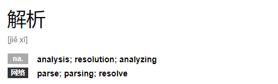

= 编程中的解析(Parse vs Resolve vs Analyze)
pxzxj; pudge.zxj@gmail.com; 2023/02/23

`解析` 是软件开发中的一个高频词汇，但在英文中表达 `解析` 语义的单词却很多，本文结合Spring Framework源码对比常用的三个表达解析的单词深层的不同以帮助开发者做出正确选择。

== Parse

[quote, dictionary.cambridge.org]
____________________________________________________________________
to separate a sentence into grammatical parts, such as subject, verb, etc.
____________________________________________________________________

Spring Framework中 `Parse` 相关的有如下接口

.org.springframework.format.Parser
[source,java,subs="verbatim"]
----
@FunctionalInterface
public interface Parser<T> {

	/**
	 * 将文本根据不同语系解析为T的实例
	 */
	T parse(String text, Locale locale) throws ParseException;

}
----

.org.springframework.expression.ExpressionParser
[source,java,subs="verbatim"]
----
public interface ExpressionParser {

	/**
	 * 将表达式解析为可执行的Expression对象
	 */
	Expression parseExpression(String expressionString) throws ParseException;

}
----

.org.springframework.beans.factory.xml.BeanDefinitionParser
[source,java,subs="verbatim"]
----
public interface BeanDefinitionParser {

	/**
	 * 将Xml元素解析为BeanDefinition对象
	 */
	@Nullable
	BeanDefinition parse(Element element, ParserContext parserContext);

}
----

综合 `Parse` 的定义与Spring Framework中的实践可以将它的使用场景归纳为：`Parse` 用于内容已知但需要对它的格式、表现形式或存储方式做一定转换并且转换过程中可能需要对内容按照特定语法做拆分的场景，例如Xml解析、Json解析、Excel解析都应该使用 `Parse` 表示

== Resolve

[quote, dictionary.cambridge.org]
____________________________________________________________________
to solve or end a problem or difficulty
____________________________________________________________________

Spring Framework中 `Resolve` 相关的有如下接口

.org.springframework.expression.BeanResolver
[source,java,subs="verbatim"]
----
public interface BeanResolver {

	/**
	 * 根据Bean的名称查找并返回对应的Bean实例
	 */
	Object resolve(EvaluationContext context, String beanName) throws AccessException;

}
----

.org.springframework.web.servlet.LocaleResolver
[source,java,subs="verbatim"]
----
public interface LocaleResolver {

	/**
	 * 从请求中解析Locale
	 */
	Locale resolveLocale(HttpServletRequest request);

}
----

.org.springframework.web.servlet.HandlerExceptionResolver
[source,java,subs="verbatim"]
----
public interface HandlerExceptionResolver {

	/**
	 * SpringMVC执行过程中将异常解析为错误页面
	 */
	@Nullable
	ModelAndView resolveException(
			HttpServletRequest request, HttpServletResponse response, @Nullable Object handler, Exception ex);

}
----

综合 `Resolve` 的定义与Spring Framework中的实践可以将它的使用场景归纳为：需要对原始内容做一定的业务处理和计算后生成与原始内容相关但完全不同的目标内容的场景，例如DNS解析需要访问DNS服务器查询域名对应的IP地址，域名与IP是相关的但它们的内容却完全不同，因此需要使用 `Resolve` 表示，甚至Linux的DNS服务器配置文件名也是 `resolv.conf`

TIP: `Resolve` 虽然可以翻译为解析，但它的重点在于能够以某种方式使用原始内容解决问题，这一点在它的英文释义中也有体现

== Analyze

[quote, dictionary.cambridge.org]
____________________________________________________________________
to study or examine something in detail, in order to discover more about it
____________________________________________________________________

Spring Boot中 `Analyze` 相关的有如下接口

.org.springframework.boot.diagnostics.FailureAnalyzer
[source,java,subs="verbatim"]
----
@FunctionalInterface
public interface FailureAnalyzer {

	/**
	 * Returns an analysis of the given {@code failure}, or {@code null} if no analysis
	 * was possible.
	 * @param failure the failure
	 * @return the analysis or {@code null}
	 */
	FailureAnalysis analyze(Throwable failure);

}
----

综合 `Analyze` 的定义与Spring Boot中的实践可以将它的使用场景归纳为：通过对原始内容做深层研究和剖析生成更有价值或更直观的目标内容的场景，例如上面的 `FailureAnalyzer` 通过分析异常返回失败原因

TIP: `Resolve` 和 `Analyze` 的主要区别在于 `Analyze` 强调对原始内容本身的深层分析产生结果，而 `Resolve` 则是使用原始内容进行业务逻辑处理后产生结果