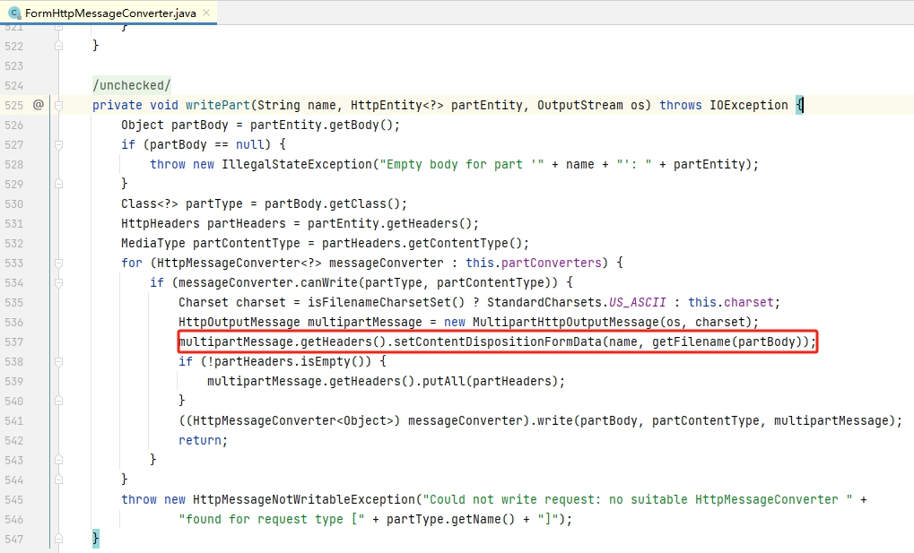

= RestTemplate使用字节数组实现文件上传
pxzxj; pudge.zxj@gmail.com; 2024/02/20

`RestTemplate` 是Spring提供的一个执行Http请求的工具类，使用它可以发送文件上传请求但必须依赖本地文件，本文介绍一种直接使用字节数组创建文件上传请求的方法

== 工程准备

假设存在如下服务端代码用于接收上传的文件

[source,java,subs="verbatim"]
----
	@PostMapping("/create")
	public void create(String pathname, @RequestParam("file") MultipartFile multipartFile) {
		//...
	}
----

[[file-upload]]
== 上传本地文件

在网络上搜索使用RestTemplate上传文件都会得到类似如下代码的答案，其中的关键点一是使用 `MultiValueMap`，二是使用 `FileSystemResource`

[source,java,subs="verbatim"]
----
		MultiValueMap<String, Object> multiValueMap = new inkedMultiValueMap<>();
        File file = new File(filepath);
		multiValueMap.add("file", new FileSystemResource(file));
		multiValueMap.add("pathname", pathname);
        restTemplate.postForEntity(url, new HttpEntity<>(multiValueMap), String.class);
----

== 上传字节数组

在很多场景下上传的内容不是来自于本地文件，可能是代码中生成或者从其它服务读取到，不论来源如何都可以转换为字节数组，如果按照 <<file-upload, 上面>>的方案就需要先将字节数组存储为本地文件再次读取为 `FileSystemResource` 对象，在已经拥有文件内容数组的情况下再把它保存为文件再读取出来显然是多此一举，那么能不能直接使用已有的字节数组来创建文件上传请求呢？刚好存在一个类似的 `ByteArrayResource`，是不是只要把 `new FileSystemResource(file)` 替换为 `new ByteArrayResource(bytes)` 就可以了呢？

此处省去调试的过程直接介绍最终的结论，直接替换是不行的，`FileSystemResource` 和 `ByteArrayResource` 都实现了 `org.springframework.core.io.Resource` 接口，而 `Resource` 接口有一个方法 `@Nullable String getFilename();`，`FileSystemResource` 接口的次方法会返回底层的文件名，而 `ByteArrayResource` 仅返回null

`RestTemplate` 执行文件上传请求时会调用 `FormHttpMessageConverter.writePart` 方法来构建请求信息，方法内部会调用 `Resource.getFilename()` 来生成 `Content-Disposition` 请求头，`getFilename()` 方法返回null时 `Content-Disposition` 请求头就不包含 `filename` 信息，进一步服务端不会将其识别为文件

明确了不能直接替换的原因后解决方案也很简单，只需要让 `ByteArrayResource` 的 `getFilename()` 方法返回一个非null的值即可

.ByteArrayWithNameResource.java
[source,java,subs="verbatim"]
----
class ByteArrayWithNameResource extends ByteArrayResource {

		private String name = "useless";

		ByteArrayWithNameResource(byte[] byteArray) {
			super(byteArray);
		}

		ByteArrayWithNameResource(byte[] byteArray, String description) {
			super(byteArray, description);
		}

		ByteArrayWithNameResource(String name, byte[] byteArray) {
			super(byteArray);
			this.name = name;

		}

		ByteArrayWithNameResource(String name, byte[] byteArray, String description) {
			super(byteArray, description);
			this.name = name;
		}

		@Override
		public String getFilename() {
			return name;
		}
	}
----

`MultiValueMap` 中添加 `ByteArrayWithNameResource` 对象即可

[source,java,subs="verbatim"]
----
multiValueMap.add("file", new ByteArrayWithNameResource("my.txt", bytes));
----