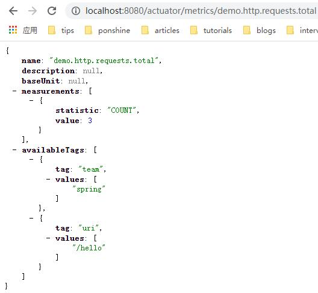
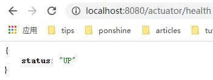

= 使用Micrometer记录Java应用指标

本文根据SpringOne 2019的演讲Performance Monitoring Backend and Frontend using Micrometer整理而成，英语能力不错的建议直接观看下面的原始视频

bilibili::BV1jQ4y1q7uC[]

xref:slides/SpringOne2019-ClintChecketts-PerformanceMonitoringBackendandFrontendUsingMicrometer.pdf[PPT] https://github.com/checketts/micrometer-springone-2019[代码]

== Observability

监控告警是软件系统尤其是对可用性要求高的软件系统的重要组成部分，通过监控告警可以防患于未然，将故障对业务系统的影响降到最低 +
通常监控需要包含三部分内容日志、指标、跟踪

*日志(Logging)*  ::
日志记录了所有业务操作的详细信息，对日常问题定位起着至关重要的左右。日志记录通常使用日志框架Slf4j、Log4j、Logback实现，小应用直接使用日志文件即可无需考虑其它存储方式，而对中大型的应用或者微服务场景中一般使用ELFK的方案存储日志

*指标(Metrics)*  ::
指标是对某一业务数据的统计或聚合例如常见的CPU利用率、接口访问量等，相比日志指标是更直观的数据，基于指标可以快速发现系统存在在的问题，指标一般也会与告警系统一起使用使运维人员能在问题出现时立刻收到通知 +
指标统计可以使用Micrometer实现，Micrometer的使用也是本文的主要内容，指标的结果一般使用时序数据库进行存储常见的如InfluxDB、Prometheus等

*跟踪(Traceing)* ::
跟踪通常只在比较复杂的业务系统例如一个业务操作需要调用不同的应用程序完成的场景中使用，通过traceId可以将这些不同的调用关联起来进行分析 +
Zipkin可以用来实现应用跟踪

== Micrometer

Micrometer用于在JVM应用中实现指标统计功能，它的最大特点是使用了类似Slf4j门面模式的设计，使开发者无需关注指标的存储实现，直接使用统一的API记录即可，开发完成后可以选择Micrometer支持的任意一种或多种存储系统，正如使用Slf4j记录的日志既可以使用Log4j的实现也可以使用Logback的实现

=== 支持的监控软件

Micrometer支持众多监控软件，这些软件一般会通过下面两种方式进行分类

==== 基于指标格式分类
指标格式有基于维度的(Dimensional)和基于层级的(Hierarchical)两种，Dimensional指标是由一个名称和多个Tag组成，每个Tag是一个键值对，Hierarchical指标则只有一个名称，所有信息都压扁保存在名称中 +

[caption=""]
.Hierarchical
====
    server1.http.requests = 10
    us-east.blue.server1.http.requests.200.users = 10
====

[caption=""]
.Dimensional
====
    http_requests{server="server1"} 10
    http_requests{server="server1", region="us-east", cluster="blue", status="200", uri="users"} 10
====

从上面的示例可以看出基于维度的指标有两个优点，首先是意义更清晰，它的每个维度都是一个key-value格式的数据，通过维度信息可以很明确看出指标的意义，而基于层级的只有value而没有key，所以不容易理解；另一个优点是它更灵活便于修改，指标维度变化时可以直接修改而不破坏原来的结构

|===
|Dimensional |Hierarchical

|AppOptics, Atlas, Azure Monitor, Cloudwatch, Datadog, Datadog StatsD, Dynatrace, Elastic, Humio, Influx, KairosDB, New Relic, Prometheus, SignalFx, Sysdig StatsD, Telegraf StatsD, Wavefront
|Graphite, Ganglia, JMX, Etsy StatsD
|===

==== 基于采集方式分类
采集方式有Client push和Server poll两种方式，不管哪种方式都是周期执行

|===
|Client pushes |Server polls

|AppOptics, Atlas, Azure Monitor, Datadog, Elastic, Graphite, Ganglia, Humio, Influx, JMX, Kairos, New Relic, SignalFx, Wavefront
|Prometheus, all StatsD flavors
|===

=== 术语

==== Meter

Meter表示一个指标，新增业务指标时首先需要确定它的类型，Micrometer支持下面几种类型

- Counter：计数器，用于保存单调递增型的数据，例如站点的访问次数，JVM的GC次数等；不能为负值，也不支持减少，但可以重置为0
- Gauge：仪表盘，用于存储有着起伏特征的数据，例如堆内存的大小，注意能用Counter记录的指标不要用Guage
- Timer：计时器，记录事件的次数和总时间，例如HTTP请求消耗的时间，Timer同时也会包含次数统计，不需要再使用Counter
- Distribution Summaries： 用于跟踪事件的分布，与Timer结构类似，但值的单位可以是自定义的任意单位

确定类型后要为指标取一个合适的名称并添加标签(Tag)，名称最好由小写字母和点组成例如http.request.count，标签是key-value格式的数据，key-value都是字符串，key最好也只包含小写字母和点，一个指标可以包含多个Tag，最终的指标形式如下

====
cpu.usage {"host"="192.168.3.1"} +
cpu.usage {"host"="192.168.3.2"}
====

名称和标签唯一确定了一个指标，上面的示例表示示两台主机的cpu利用率，host值不同就是两个不同的指标

其它指标相关内容 https://micrometer.io/docs/concepts[官方文档]

==== MeterRegistry
MeterRegistry代表指标的存储，每种监控软件都有对应的MeterRegistry实现

=== Examples

==== Counter & Timer
====
[source,java,subs="verbatim"]
----
package io.github;

import io.micrometer.core.instrument.*;
import io.micrometer.core.instrument.composite.CompositeMeterRegistry;
import io.micrometer.core.instrument.config.MeterFilter;
import io.micrometer.core.instrument.logging.LoggingMeterRegistry;
import io.micrometer.core.instrument.logging.LoggingRegistryConfig;
import io.micrometer.core.instrument.simple.SimpleMeterRegistry;
import org.junit.jupiter.api.Test;

import java.time.Duration;
import java.util.ArrayList;
import java.util.Arrays;
import java.util.List;
import java.util.concurrent.TimeUnit;
import java.util.stream.Collectors;

public class MicrometerTest {

    private List<Chore> chores = Arrays.asList(
            new Chore("Mow front lawn", Duration.ofMinutes(20), "yard"),
            new Chore("Mow back lawn", Duration.ofMinutes(10), "yard"),
            new Chore("Gather the laundry", Duration.ofMinutes(7), "laundry"),
            new Chore("Wash the laundry", Duration.ofMinutes(3), "laundry"),
            new Chore("Sort/Fold the laundry", Duration.ofMinutes(50), "laundry"),
            new Chore("Was the dishes", Duration.ofMinutes(10), "kitchen"),
            new Chore("Find my phone charger", Duration.ofMinutes(5))
    );

    @Test
    void testCounterAndTimer() {
        MeterRegistry meterRegistry = new SimpleMeterRegistry();                 // <1>
        for(Chore chore : chores) {
            System.out.println("Doing " + chore.getName());
            meterRegistry.counter("chore.completed").increment();                // <2>
            meterRegistry.timer("chore.duration").record(chore.getDuration());   // <3>
        }

        for(Meter meter : meterRegistry.getMeters()) {
            System.out.println(meter.getId() + "   " + meter.measure());
        }
    }

        static class Chore {

        private String name;
        private Duration duration;
        private String group;

        public Chore(String name, Duration duration, String group) {
            this.name = name;
            this.duration = duration;
            this.group = group;
        }

        public Chore(String name, Duration duration) {
            this.name = name;
            this.duration = duration;
            this.group = "home";
        }

        //getter, setter
    }
}
----
<1> `SimpleMeterRegistry` 可以用来测试Micrometer的功能，
<2> `MeterRegistry` 的 `counter()` 方法用来创建Counter类型指标，`Counter.increment()` 方法表示该指标值加1
<3> `MeterRegistry` 的 `timer()` 方法用来创建Counter类型指标，`Timer.record()` 方法记录事件耗时
====

TIP: 可以在 https://github.com/pxzxj/micrometer-demo[GitHub] 下载示例源码

==== CompositeRegistry  &  LoggingRegistry
====
[source,java,subs="verbatim"]
----
public class MicrometerTest {

    @Test
    void testCompositeMeterRegistryAndLoggingMeterRegistry() throws InterruptedException {
        CompositeMeterRegistry meterRegistry = Metrics.globalRegistry;       //  <1>
        LoggingRegistryConfig loggingRegistryConfig = new LoggingRegistryConfig() {
            @Override
            public String get(String s) {
                return null;
            }

            @Override
            public boolean logInactive() {
                return true;
            }

            @Override
            public Duration step() {
                return Duration.ofSeconds(5);
            }
        };   // <2>
        MeterRegistry loggingRegistry = new LoggingMeterRegistry(loggingRegistryConfig, Clock.SYSTEM);
        meterRegistry.add(loggingRegistry);
        meterRegistry.add(new SimpleMeterRegistry());
        for(Chore chore : chores) {
            System.out.println("Doing " + chore.getName());
            meterRegistry.counter("chore.completed").increment();
            meterRegistry.timer("chore.duration").record(chore.getDuration());
        }
        for(Meter meter : meterRegistry.getMeters()) {
            System.out.println(meter.getId() + "   " + meter.measure());
        }
        for(int i = 1; i < 100; i++) {           // <3>
            TimeUnit.SECONDS.sleep(1);
            System.out.println("Waiting " + i);
        }
    }
}
----
<1> 可以使用 `Metrics.globalRegistry` 也可以使用 `new CompositeMeterRegistry()`
<2> 设置日志每5秒推送一次
<3> 等100s为了观察 `LoggingMeterRegistry`的效果
====

==== Tags & CommonsTags
====
[source,java,subs="verbatim"]
----
public class MicrometerTest {

    @Test
    void testTagsAndCommonTags() throws InterruptedException {
        MeterRegistry meterRegistry = new SimpleMeterRegistry();
        meterRegistry.config().commonTags("team", "spring");          //  <1>
        for(Chore chore : chores) {
            System.out.println("Doing " + chore.getName());
            meterRegistry.counter("chore.completed").increment();
            meterRegistry.timer("chore.duration", Tags.of("group", chore.getGroup())).record(chore.getDuration());  // <2>
        }
        for(Meter meter : meterRegistry.getMeters()) {
            System.out.println(meter.getId() + "   " + meter.measure());
        }
    }

}
----
<1> 添加commonsTags，commonsTag就是对所有指标都生效的Tag
<2> 使用 两个参数的 `timer()` 方法为Timer指标添加Tag
====

==== Gauge
====
[source,java,subs="verbatim"]
----
public class MicrometerTest {

    @Test
    void testGauge() throws InterruptedException {
        CompositeMeterRegistry meterRegistry = Metrics.globalRegistry;
        LoggingRegistryConfig loggingRegistryConfig = new LoggingRegistryConfig() {
            @Override
            public String get(String s) {
                return null;
            }

            @Override
            public boolean logInactive() {
                return true;
            }

            @Override
            public Duration step() {
                return Duration.ofSeconds(5);
            }
        };
        MeterRegistry loggingRegistry = new LoggingMeterRegistry(loggingRegistryConfig, Clock.SYSTEM);
        meterRegistry.add(loggingRegistry);
        meterRegistry.add(new SimpleMeterRegistry());
        meterRegistry.config().commonTags("team", "spring");
        addGauge(meterRegistry);
        for(Chore chore : chores) {
            System.out.println("Doing " + chore.getName());
            meterRegistry.counter("chore.completed").increment();
            meterRegistry.timer("chore.duration", Tags.of("group", chore.getGroup())).record(chore.getDuration());
        }
        for(Meter meter : meterRegistry.getMeters()) {
            System.out.println(meter.getId() + "   " + meter.measure());
        }
        System.gc();
        for(int i = 1; i < 100; i++) {
            TimeUnit.SECONDS.sleep(1);
            System.out.println("Waiting " + i);
        }
    }

    void addGauge(MeterRegistry meterRegistry) {
        List<Chore> choresList = new ArrayList<>(chores);
        meterRegistry.gauge("chore.size.weak", choresList, List::size);          //     <1>
        meterRegistry.gauge("chore.size.lambda", "", o -> choresList.size());    //   <2>
        Gauge.builder("chore.size.strong", choresList, List::size).strongReference(true).register(meterRegistry);  //  <3>
    }
}
----
<1> Gauge默认使用弱引用，可能出现值为NaN，演示演示效果时需要注释掉下面两行
<2> 使用Lambda表达式解决弱引用问题
<3> 使用强引用
====

=== 最佳实践

==== 避免指标数量过多

在使用Micrometer时要注意指标数量，不要出现数量爆炸(Cardinality Explosion)

下面是一个典型的示例，有个查询用户的接口 `/user/\{id}` ，新增了一个指标 `http_request` 记录接口调用量，如果把每次用户请求的url作为一个Tag去记录指标那么最终该接口会出现无数个指标，合理的方式是用 `/user/\{id}` 作为Tag

image::images/cardinality-explosion.png[]

==== 使用MeterFilter降噪

解决指标数量爆炸的另一种方式是MeterFilter，它能够重写指标的Tag甚至是直接忽略指标

====
[source,java,subs="verbatim"]
----
public class MicrometerTest {

    @Test
    void testMeterFilter() throws InterruptedException {
        MeterRegistry meterRegistry = new SimpleMeterRegistry();
        meterRegistry.config().meterFilter(MeterFilter.deny(id -> id.getName().equals("chore.completed")));   //  <1>
        meterRegistry.config().meterFilter(MeterFilter.maximumAllowableMetrics(2));                           //  <2>
        meterRegistry.config().meterFilter(new MeterFilter() {                                                //  <3>
            @Override
            public Meter.Id map(Meter.Id id) {
                if(id.getName().equals("chore.duration")) {
                    return id.replaceTags(id.getTags().stream().map(tag -> {
                        if(tag.getKey().equals("group") && tag.getValue().equals("laundry")) {
                            return tag;
                        } else {
                            return Tag.of("group", "other");
                        }
                    }).collect(Collectors.toList()));
                } else {
                    return id;
                }
            }
        });
        meterRegistry.config().commonTags("team", "spring");
        for(Chore chore : chores) {
            System.out.println("Doing " + chore.getName());
            meterRegistry.counter("chore.completed").increment();
            meterRegistry.timer("chore.duration", Tags.of("group", chore.getGroup())).record(chore.getDuration());
        }
        for(Meter meter : meterRegistry.getMeters()) {
            System.out.println(meter.getId() + "   " + meter.measure());
        }
    }

}
----
<1> deny()方法用于屏蔽部分指标
<2> maximumAllowableMetrics()方法设置最大指标数量，超出此数量的指标会直接忽略
<3> map()方法可以转换指标的Tag

====

MeterFilter还有更多用法可以自行查看其API

== Spring Boot image:images/heart.png[25,25] Micrometer

Spring Boot的Actuator模块提供了与Micrometer的整合，因此在Spring Boot中使用Micrometer会更简单

[source,xml,,subs="verbatim"]
----
		<dependency>
		    <groupId>org.springframework.boot</groupId>
		    <artifactId>spring-boot-starter-actuator</artifactId>
		</dependency>
----

[[autowired-mr]]
=== Autowired MeterRegistry

Spring Boot自动配置了一个 `CompositeMeterRegistry` ，因此应用代码中无需再创建，可以直接使用依赖注入，下面是一个构造器注入的示例

====
[source,java,subs="verbatim"]
----
package io.github.controller;

import io.micrometer.core.instrument.Counter;
import io.micrometer.core.instrument.Meter;
import io.micrometer.core.instrument.MeterRegistry;
import io.micrometer.core.instrument.Tags;
import org.springframework.web.bind.annotation.GetMapping;
import org.springframework.web.bind.annotation.RestController;

@RestController
public class HelloController {

    private Counter counter;

    public HelloController(MeterRegistry meterRegistry) {
        this.counter = meterRegistry.counter("demo.http.requests.total", Tags.of("uri", "/hello"));
    }

    @GetMapping("/hello")
    public String hello() {
        counter.increment();
        return "Hello Micrometer!";
    }
}

----
====

还可以使用 `MeterRegistryCustomizer` 对Spring自动配置的 `MeterRegistry` 做更多配置

====
[source,java,subs="verbatim"]
----
@Configuration
public class MicrometerConfig {

    @Bean
    public MeterRegistryCustomizer<MeterRegistry> meterRegistryCustomizer() {
        return registry -> registry.config().commonTags("team", "spring");
    }

}
----
====

=== Metrics Endpoint

Actuator提供了/metrics端点用于查看指标的值，首先需要暴露此端点

[source,yaml,configblocks,subs="verbatim"]
----
management:
  endpoints:
    web:
      exposure:
        include: health,metrics,prometheus
----
浏览器访问/actuator/metrics就可以看到所有的指标

image::images/meters-endpoint.jpg[]

可以看到除了上一步添加的 `demo.http.requests.total` 指标外还有许多其它指标，这些都是Spring Boot默认提供的，实际上这里只是一部分默认指标，完整的可以参考 https://docs.spring.io/spring-boot/docs/current/reference/htmlsingle/#actuator.metrics.supported[官方文档] 进行查看

/metrics后还可以添加特定指标名称查看此指标的值，还可以使用tag参数做进一步过滤，tag参数格式为 `tag=\{key}:\{value}`

=== RestTemplate

Spring Boot自动配置 `RestTemplateBuilder` 已经添加了指标统计的功能，使用它创建的 `RestTemplate` 会使用一个名称为 `http.client.requests` 的Timer指标记录请求的时延，但要注意接口调用时要使用UriTemplate的形式，否则会出现上文提到的数量爆炸问题

====
[source,java,subs="verbatim"]
----
@RestController
public class HelloController {

    private RestTemplate restTemplate;

    public HelloController(RestTemplateBuilder builder) {
        this.restTemplate = builder.build();
    }

    @GetMapping("/restwithuritemplate")
    public Map<String, String> restWithUriTemplate(String suffix) {
        return Collections.singletonMap("html", restTemplate.getForObject("https://tieba.baidu.com/{suffix}", String.class, suffix));
    }

    @GetMapping("/restwithouturitemplate")
    public Map<String, String> restWithoutUriTemplate(String suffix) {
        return Collections.singletonMap("html", restTemplate.getForObject("https://tieba.baidu.com/" + suffix, String.class));
    }

}
----
====

=== MeterBinder
<<autowired-mr, 上文>>的示例直接向Bean中注入 `MeterRegistry` 用来记录指标，这样对原代表有很强的侵入性，直接影响了原本的依赖关系，一种更好的方法是使用 `MeterBinder`

====
[source,java,subs="verbatim"]
----
import io.micrometer.core.instrument.Gauge;
import io.micrometer.core.instrument.binder.MeterBinder;

import org.springframework.context.annotation.Bean;

public class MyMeterBinderConfiguration {

    @Bean
    public MeterBinder queueSize(Queue queue) {
        return (registry) -> Gauge.builder("queueSize", queue::size).register(registry);
    }

}
----
====

=== MeterFilter
Spring Boot应用中声明为Bean的MeterFilter会自动配置在MeterRegistry上

[source,java,subs="verbatim"]
----
import io.micrometer.core.instrument.config.MeterFilter;

import org.springframework.context.annotation.Bean;
import org.springframework.context.annotation.Configuration;

@Configuration(proxyBeanMethods = false)
public class MyMetricsFilterConfiguration {

    @Bean
    public MeterFilter renameRegionTagMeterFilter() {
        return MeterFilter.renameTag("com.example", "mytag.region", "mytag.area");
    }

}

----

=== Common Tags
Spring Boot应用可以在application.yml中配置CommonTag

[source,yaml,configblocks,subs="verbatim"]
----
management:
  metrics:
    tags:
      application: ${spring.application.name}
      country: cn
----

=== HealthInfo

Spring Boot 能够对应用本身及依赖的其它外部组件做简单的健康检查，例如Redis是否正常、磁盘空间是否正常等， https://docs.spring.io/spring-boot/docs/current/reference/htmlsingle/#actuator.endpoints.health.auto-configured-health-indicators[所有]这些检查项都需要实现 `HealthIndicator` 接口，健康检查的结果通常只是简单的服务是否存活，不包含特别详细的指标信息

[source,java,subs="verbatim"]
----
public interface HealthIndicator extends HealthContributor {
    /**
     * Return an indication of health.
     * @return the health
     */
	Health health();
}
----

监控检查的结果可以通过 `/health` 端点查看

在生产环境中监控检查的结果需要接入真实的监控系统从而实现服务故障时的告警通知，因此可以将健康检查的结果也转换为指标输出

====
[source,java,subs="verbatim"]
----
package io.github.controller;

import io.micrometer.core.instrument.MeterRegistry;
import io.micrometer.core.instrument.Tags;
import io.micrometer.core.instrument.binder.MeterBinder;
import org.springframework.beans.factory.InitializingBean;
import org.springframework.boot.actuate.health.Health;
import org.springframework.boot.actuate.health.HealthIndicator;
import org.springframework.boot.actuate.health.Status;
import org.springframework.scheduling.concurrent.ThreadPoolTaskScheduler;
import org.springframework.stereotype.Component;

import java.time.Duration;
import java.util.Map;
import java.util.concurrent.ConcurrentHashMap;

@Component
public class HealthToMetricsConverter implements InitializingBean, MeterBinder {

    private Map<String, HealthIndicator> map;

    private ThreadPoolTaskScheduler scheduler;

    private final ConcurrentHashMap<String, Health> latestHealth = new ConcurrentHashMap<>();

    public HealthToMetricsConverter(Map<String, HealthIndicator> map) {
        this.map = map;
        this.scheduler = new ThreadPoolTaskScheduler();
        scheduler.setPoolSize(5);
        scheduler.setThreadNamePrefix("ThreadPoolTaskScheduler");
        scheduler.initialize();
    }

    @Override
    public void afterPropertiesSet() throws Exception {
        for(Map.Entry<String, HealthIndicator> entry : map.entrySet()) {
            scheduler.scheduleWithFixedDelay(() -> latestHealth.put(entry.getKey(), entry.getValue().health()), Duration.ofSeconds(10));    // <1>
        }
    }

    @Override
    public void bindTo(MeterRegistry registry) {
        for(Map.Entry<String, Health> entry : latestHealth.entrySet()) {
            registry.gauge("health.indicator", Tags.of("name", entry.getKey()), entry.getValue(), health -> {
                Status status = health.getStatus();
                double v = 3.0;
                if(status.equals(Status.UP)) {         // <2>
                    v = 1.0;
                } else if(status.equals(Status.DOWN)) {
                    v = -1.0;
                } else if(status.equals(Status.OUT_OF_SERVICE)) {
                    v = -2.0;
                }
                return v;
            });
        }
    }
}
----
<1> 健康检查可能是很慢的过程，而指标采集需要快速，因此使用线程池定期保存监控检查的结果
<2> 指标的值必须是数字，因此将Status转为数字
====

== Prometheus & Grafana

Micrometer使用了门面模式，使用不同的监控系统只需要添加对应的依赖 `micrometer-registry-\{system}` 即可，Prometheus对应如下依赖

[source,xml,subs="verbatim"]
----
		<dependency>
			<groupId>io.micrometer</groupId>
			<artifactId>micrometer-registry-prometheus</artifactId>
		</dependency>
----

TIP: Prometheus的安装很简单，在官网下载安装包解压运行即可

Prometheus是使用pull的方式采集数据，Actuator模块会使用 `/prometheus` 端点暴露所有指标数据，因此在Prometheus的配置文件 `prometheus.yml` 中配置采集的目标和接口如下

[source,yaml,subs="verbatim"]
----
scrape_configs:
  - job_name: "myapp"
    metrics_path: "/actuator/prometheus"
    static_configs:
      - targets: ["HOST:PORT"]
----

NOTE: 静态配置的方式实际上并不推荐，Prometheus支持使用服务发现的方式如Eureka、Zookeeper添加target，具体配置方式参考 https://prometheus.io/docs/prometheus/latest/configuration/configuration/[官方网站]

最后在Grafana中添加Prometheus作为数据源并添加Spring Boot仪表盘，就可以非常直观地查看所有指标数据了

image::images/grafana.jpg[]

