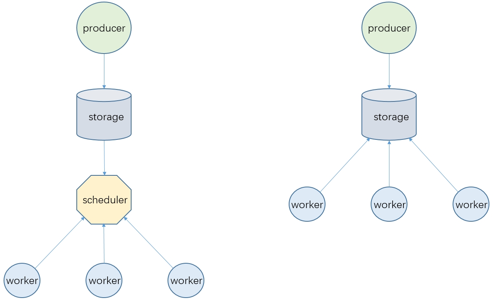

= 两种任务调度模式
pxzxj; pudge.zxj@gmail.com; 2024/08/22

构建业务系统时通常会把一些耗时且复杂的任务放在一个独立的服务中执行，即上图中的 `worker`，任务量大时为了更快地完成任务还必须启动多个 `worker` 服务实例，此时就需要考虑怎么把一批任务合理地分配到这些 `worker` 上执行，本文把这个分配过程称为 *调度*

下图是两种典型的调度模式，其中 `producer` 代表任务的生产者，通常是一个单独的服务，`storage` 代表任务信息的存储，可能是普通的RDB也可能是Redis或消息中间件，下文对这两种模式进一步详细介绍

== 单独调度服务

`scheduler` 代表一个单独的调度服务，所有 `worker` 都从 `scheduler` 获取任务信息，可能是scheduler主动 `push` 也可能是 `worker` 不断 `poll`

NOTE: `push` 和 `poll` 模式当然也各有利弊，读者可以自行查阅相关资料了解

此模式的优势是 `worker` 更轻量级，尤其是使用基于http协议的 `poll` 获取任务时，此时 `worker` 不再局限于使用Java实现，几乎任何语言都可能快速开发出一个 `worker` 服务

此外此模式还支持在 `scheduler` 中实现比较复杂的调度策略例如指定 `worker`、延迟执行等，还能对任务执行做进一步管理，例如任务的超时、重试等

此模式的缺点主要在于开发难度较高，尤其是 `scheduler` 要考虑到调度过程中的诸多细节，例如怎么实现各个 `worker` 平均分配、怎么保证 `scheduler` 的高可用，要不要根据 `worker` 当前性能情况动态调整调度数量等等，在之前的项目中多次出现过因为 `scheduler` 设计缺陷导致 `任务卡住` 的问题

== worker自调度

该模式由 `worker` 直接从 `storage` 中获取任务，获取的方法完全取决于 `storage` 的类型，如果是RDB就轮询执行sql语句查询任务信息表，如果是消息中间件就把 `worker` 作为一个消费者，该模式依赖 `worker` 自身实现合理调用

该模式的优点是架构简单，开发难度也较低，开发者只需要掌握基础的 `storage` 操作API即可

该模式的缺点同样明显，不支持复杂调度策略，但是注意一些常见的策略如按照 `任务优先级` 调度是完全能够实现的，此外在跨语言上此模式也不如前一种