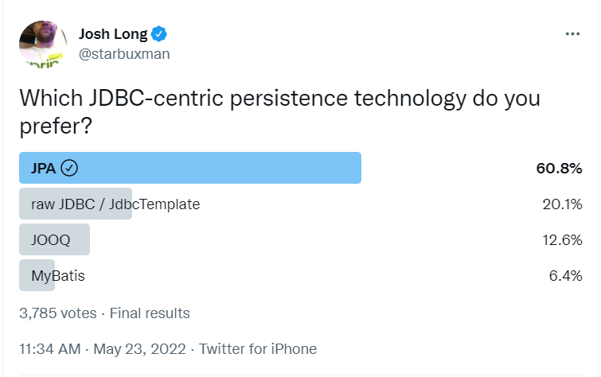
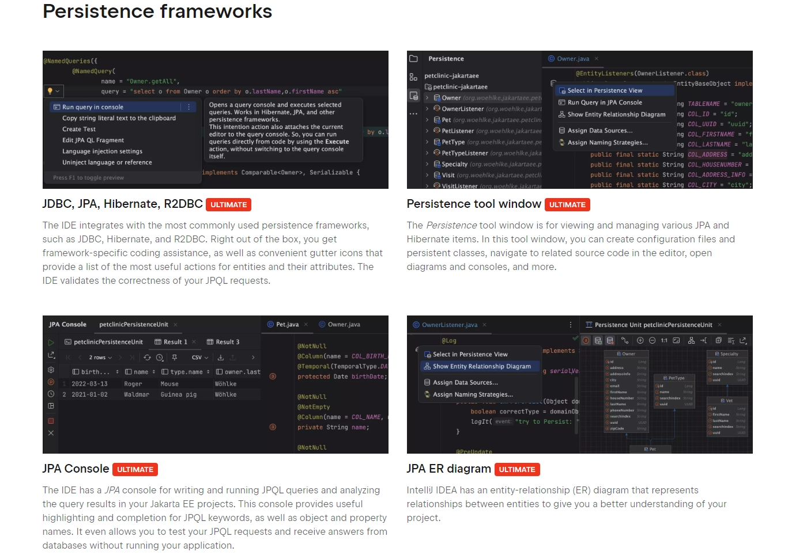
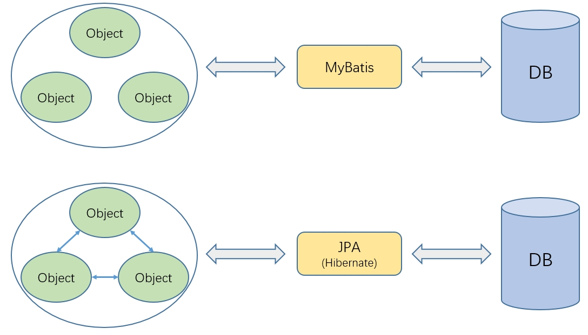

= 为什么应该使用Spring Data JPA
pxzxj; pudge.zxj@gmail.com; 2024/08/05

== 现状

(https://x.com/starbuxman/status/1528655715933597697[via])

(https://www.jetbrains.com/idea/jakarta/[via])

[big]*Intellij IDEA和Spring不断新增对JPA的特性支持*

== 介绍

=== Libraries

image::images/java-libraries.png[]

=== Official Libraries

* Servlet
* JDBC
* WebSocket Client
* Email Client
* Validation
* JAX-RS(The Java API for RESTful Web Services)
* JPA
* javax.xxx/jakarta.xxx

=== JPA

https://jcp.org/en/jsr/detail?id=338[JPA]（Java Persistence API）是Java EE规范的一部分，它提供了一种将Java对象映射到关系数据库表的标准方法。JPA旨在简化数据持久化过程，即把内存中的对象状态保存到数据库中，以及从数据库中恢复对象状态到内存中。通过这种方式，开发者可以更加专注于业务逻辑的实现，而不是数据库操作的细节。

JPA包含了一系列的标准接口和类，这些接口和类定义了对象关系映射（ORM）的标准。开发者可以使用这些接口和类来创建实体（Entity）类，这些类代表数据库中的表，并使用注解（Annotations）或XML映射文件来定义实体与数据库表之间的映射关系。

=== JPA vs MyBatis

ORM（Object-Relational Mapping）框架是一种在面向对象的编程语言中使用的技术，它提供了一种将对象模型映射到关系型数据库表的方式，MyBatis只能映射孤立的对象和数据库表，而不能映射对象间的关系，也就是说只实现了OM，因此有时候会把MyBatis称为 *半个ORM框架*

=== Spring Data JPA

https://spring.io/projects/spring-data-jpa[Spring Data JPA]是Spring Data设计思想在JPA上的实现，允许开发者以一种声明式和简洁的方式来处理数据库操作，使用它能够极大地简化JPA的使用，减少模板代码，轻松构建Java EE应用

image::images/jpa-hibernate.png[]

=== 特性

* 可靠性高
* 代码可读性高
* 安全性高
* 开发效率高
* 移植性高
* 与Spring Boot整合方便

== 示例

开发一个简单的学生管理系统，学生信息包括姓名、年龄、性别、家属，一个学生对应多个家属，家属信息包含姓名、年龄、与学生关系

=== 快速开始

[source,xml,subs="verbatim"]
----
        <dependency>
            <groupId>org.springframework.boot</groupId>
            <artifactId>spring-boot-starter-data-jpa</artifactId>
        </dependency>
----

[source,java,subs="verbatim"]
----
public class Student {

    //...

    public static class Family {

        //...
    }
}

public interface StudentRepository extends CrudRepository<Student, Long> {

}
----

=== Spring Data JPA vs MyBatis

image::images/service-sdj-vs-mp.png[]

=== 声明式查询方法

[source,java,subs="verbatim"]
----
public interface StudentRepository extends CrudRepository<Student, Long> {

    List<Student> findByNameLike(String name);

}
----

[source,shell,subs="verbatim"]
----
2024-08-05 13:35:28.639  INFO 20516 --- [           main] o.s.t.c.transaction.TransactionContext   : Began transaction (1) for test context ...
Hibernate: select student0_.id as id1_0_, student0_.age as age2_0_, student0_.gender as gender3_0_, student0_.name as name4_0_ from student student0_ where student0_.name like ? escape ?
2024-08-05 13:35:28.935  INFO 20516 --- [           main] o.s.t.c.transaction.TransactionContext   : Rolled back transaction for test ...
----

=== 自定义sql

[source,java,subs="verbatim"]
----
public interface StudentRepository extends CrudRepository<Student, Long> {

    @Query(value = "update student set age=?1", nativeQuery = true)
    @Modifying
    int updateAge(Integer age);

}
----

更多特性参考 https://docs.spring.io/spring-data/jpa/reference/[官方文档]，源码参考 https://github.com/pxzxj/spring-data-jpa-sample[GitHub]

NOTE: 更多注解的用法参考 https://jcp.org/en/jsr/detail?id=338[JPA规范]