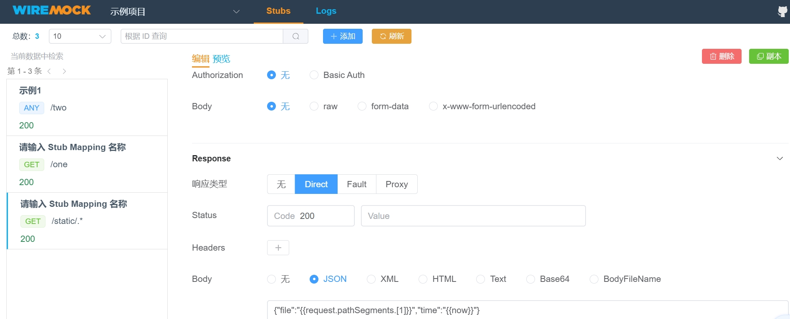

= wiremock
pxzxj; pudge.zxj@gmail.com; 2024/12/29

== why

开发一个web服务时不可避免得会涉及到对其他服务的api调用，可能是内部开发的一个微服务也可能是外部供应商提供的服务

调用其他服务给软件测试带来了困难，因为这些服务显然不是随时都能调用的，
可能是因为测试环境与生产环境网络处于不同网络环境下也可能是因为调用相应的api会导致业务状态的变化

此时一个可行的方法就是在测试环境模拟这些被调用的 `api`，即 `mock`，

`wiremock` 就是一个非常流行非常强大的 api mock工具

image::images/wiremock.png[]

[[quickstart]]
== quickstart

`wiremock` 支持使用配置来定义需要 mock的api，例如下面的配置就模拟了一个地址为 `/api/hello` 请求方法为 `GET` 的接口，
接口响应为 `Hello World`

[source,json,subs="verbatim"]
----
{
    "request": {
        "method": "GET",
        "url": "/api/hello"
    },
    "response": {
        "status": 200,
        "body": "Hello world"
    }
}
----

== how

`wiremock` 一般有两种使用方法， `unit test` 和 `standalone`

=== unit test

[source,java,subs="verbatim"]
----
import com.github.tomakehurst.wiremock.WireMockServer;
import org.junit.jupiter.api.Test;
import org.springframework.web.client.RestTemplate;

import static com.github.tomakehurst.wiremock.client.WireMock.*;
import static org.junit.jupiter.api.Assertions.assertEquals;

public class WiremockSample {

    @Test
    void test() {
        WireMockServer wireMockServer = new WireMockServer();
        wireMockServer.start();
        wireMockServer.addStubMapping(
                stubFor(get("/api/hello").willReturn(ok("Hello World"))));
        RestTemplate restTemplate = new RestTemplate();
        String response = restTemplate.getForObject(wireMockServer.url("/api/hello"), String.class);
        assertEquals("Hello World", response);
        wireMockServer.stop();
    }
}
----

=== standalone

访问 `wiremock` 的 https://wiremock.org/[官方网站]，在 `Downloas` 部分选择 `Standalone` 下载jar包并使用 `java -jar` 启动服务

`wiremock` 服务启动后jar包同级目录回创建 `mappings` 和 `__files` 两个文件夹，
<<quickstart, 上文>>定义的json文件放在 `mappings` 目录中重启服务访问 `http://localhost:8080/api/hello` 就能看到返回了 `Hello World`

服务启动后还可以访问 `/__admin/mappings` 查看当前已经加载的mock数据

==== jsonBody

如果响应是json格式则可以使用 `jsonBody` 声明相应内容避免json字符串转义，此时一般还需要使用 `headers` 配置响应头

[source,json,subs="verbatim"]
----
{
    "request": {
        "method": "GET",
        "url": "/api/hello"
    },
    "response": {
        "status": 200,
        "jsonBody": {
            "Hello": "World"
        },
        "headers": {
            "Content-Type": "application/json"
        }
    }
}
----

==== bodyFile

如果响应内容比较多还可以使用 `bodyFileName` 声明响应内容的文件，文件在 `__files` 文件夹中

[source,json,subs="verbatim"]
----
{
    "request": {
        "method": "GET",
        "url": "/body-file"
    },
    "response": {
        "status": 200,
        "bodyFileName": "response.json"
    }
}
----

==== request mapping

上文的几个示例使用了请求方法和url匹配 `mappings` 文件夹中的mock配置，实际上 `wiremock` 还支持很多更复杂的匹配方式

.url正则匹配
[source,json,subs="verbatim"]
----
{
  "request": {
    "urlPattern": "/your/([a-z]*)\\?and=query",
    ...
  },
  ...
}
----

.仅匹配url路径，忽略请求参数
[source,json,subs="verbatim"]
----
{
  "request": {
    "urlPath": "/your/url",
    ...
  },
  ...
}
----

.url参数匹配
[source,json,subs="verbatim"]
----
{
  "request" : {
    "urlPathTemplate" : "/v1/contacts/{contactId}/addresses/{addressId}",
    "method" : "GET",
    "pathParameters" : {
      "contactId" : {
        "equalTo" : "12345"
      },
      "addressId" : {
        "equalTo" : "99876"
      }
    }
  },
  "response" : {
    "status" : 200
  }
}
----

更多复杂匹配方式参考 https://wiremock.org/docs/request-matching/[官方文档]

==== response template

上文示例的响应都是静态内容不会随着请求变化，而 `response template` 则能赋予响应一定的动态能力

[source,json,subs="verbatim"]
----
{
    "request": {
        "urlPathPattern": "/static/.*",
        "method": "GET"
    },
    "response": {
        "status": 200,
        "jsonBody": {
            "file": "{{request.pathSegments.[1]}}",
            "time": "{{now}}"
        },
        "transformers": ["response-template"]
    }
}
----

`{{request.pathSegments.[1]}}` 和 `{{now}}` 都是 `wiremock` 支持的特殊语法分别表示url第二段和当前时间，
更多语法细节参考 https://wiremock.org/docs/response-templating/[官方文档]

==== single file multiple mappings

`mappings` 文件夹中一个文件可以声明多个mock的api

[source,json,subs="verbatim"]
----
{
    "mappings": [
        {
            "request": {
                "method": "GET",
                "url": "/one"
            },
            "response": {
                "status": 200
            }
        },
        {
            "id": "8c5db8b0-2db4-4ad7-a99f-38c9b00da3f7",
            "request": {
                "url": "/two"
            },
            "response": {
                "body": "Updated"
            }
        }
    ]
}
----

==== simulating faults

`wiremock` 还支持模拟api请求时的故障场景，例如响应太慢

[source,json,subs="verbatim"]
----
{
    "request": {
        "method": "GET",
        "url": "/delayed"
    },
    "response": {
        "status": 200,
        "fixedDelayMilliseconds": 2000
    }
}
----

更多故障场景参考 https://wiremock.org/docs/simulating-faults/[官方文档]

==== recorder

`wiremock` 中还有一个强大的工具 `recorder` ，使用它可以免去手动编写mock文件的过程，可以在服务启动后访问 `/__admin/recorder` 使用

本质上 `recoder` 是一个类似于nginx的代理，它在目标服务返回响应后先在 `mappings` 文件夹中保存一份再返回给client，
今后client再发送同样的请求就可以直接使用已经保存的内容来响应

image::images/wiremock-recorder.png[]

==== command line options

使用 `java -jar` 启动 `wiremock` 服务时支持很多命令行参数，此次列举常用的几个，
完整参数列表参考 https://wiremock.org/docs/standalone/java-jar/[官方文档]

--port  ::  服务端口号，例如 `--port 9999`
--root-dir  ::  `__files` 和 `mappings` 目录所属的根目录

=== api template library

从上面对 `wiremock` 的介绍可以看出最重要的就是编写mock配置文件，
如果多个客户端服务请求的是同一个目标服务那就可以相同的mock配置文件，
因此 `wiremock` 为很多大型的服务供应商都已经提供了现成的mock配置文件，
例如 `GitHub`、`Twitter`、`Amazon Cloud` 等，
如果使用了这些供应商的api就可以直接在 https://library.wiremock.org/cloud/[api template library] 上下载想应的mock配置文件

=== extensibility

`wiremock` 支持使用 `Extension` api 实现更复杂的功能，详情参考 https://wiremock.org/docs/extending-wiremock/[官方文档]

=== ui

访问 https://qadoc.cn/wiremock/stubs 添加 `wiremock` 的服务地址后可以可视化地查看mock配置

